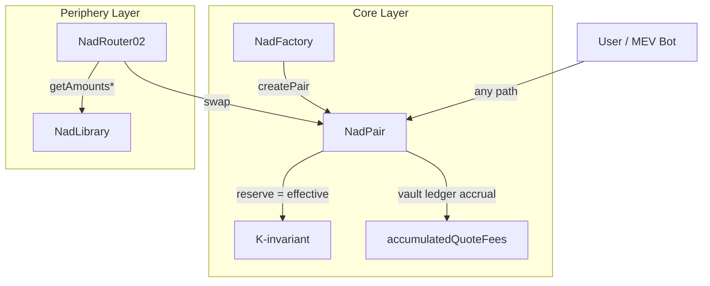

# NadSwap V2 — Final Implementation Spec (Merged)

> **"0.2% LP Fee + Per-Launch Quote-Only Trade Tax + Virtual Vault + Reverse Math"**  
> Uniswap V2 Minimal-Modification Fork — Core-Enforced Tax Model

---

## 1. Goals & Terminology

### Goals
- LP fee **fixed at 0.2%** (changed from V2's 0.3%)
- **Per-launch (per-pair) trade tax**: `buyTaxBps`, `sellTaxBps`
- Trade taxes collected **only in the Quote token (WETH, USDT, etc.)**
- **Core-level tax-bypass prevention** (including direct calls and MEV); note that integer-floor rounding can produce `tax=0` on tiny amounts

### Terminology

| Term | Definition |
|------|-----------|
| **Base** | Launch token (MEME, etc.) |
| **Quote** | Reserve currency (WETH, USDT, etc.). One per pair, fixed |
| **Net** | Amount actually received by user |
| **Gross** | Total amount including tax (`Net + Tax`) |
| **Vault** | `accumulatedQuoteFees` — on-ledger accumulated tax |
| **Effective Balance** | `rawBalance - vault` (quote side) |
| **Dust** | Raw balance excess beyond reserve (+ vault on quote side), typically from direct transfers or rounding; removable via `skim` |

---

## 2. Core Design Principles



### Canonical Contract Mapping

| Concept Alias | Canonical Contract |
|---|---|
| `NadFactory` | `UniswapV2Factory` |
| `NadPair` | `UniswapV2Pair` |
| `NadRouter02` | `UniswapV2Router02` |
| `NadLibrary` | `UniswapV2Library` |

1. **Core Enforcement**: All tax logic is embedded in `Pair.swap()` math → no alternative code path can bypass tax logic (direct calls included); tiny trades may still yield `tax=0` due to integer-floor rounding
2. **Virtual Vault**: Ledger accrual in `accumulatedQuoteFees` → gas savings by avoiding ERC20 transfers per swap
3. **Reverse Math**: Delivers exact Net amount to user as quoted by Router; internally reverse-calculates Gross
4. **Reserve = Effective**: Reserve storage/queries all use effective basis → TWAP, feeTo, and quotes are accurate

### Accounting Invariant

```
rawQuoteBalance = reserveQuote + accumulatedQuoteFees  (+ dust)
rawBaseBalance  = reserveBase                          (+ dust)
```

> [!IMPORTANT]
> This invariant only holds when the Quote token is **non-rebasing and non-fee-on-transfer**.
> NadSwap enforces Router policy on **Quote support only**.
> Base token support is not allowlist-enforced in Factory/Router under this spec revision.

---

## 3. Modified Files

| File | Scope | Key Changes |
|------|-------|-------------|
| `UniswapV2Pair.sol` | **High** | vault, effective balance, 12-step swap, tax config, claim |
| `IUniswapV2Pair.sol` | Medium | tax/quote query, set, claim interface additions |
| `IUniswapV2Factory.sol` | Medium | quote support getter (`isQuoteToken`) retained; base allowlist API removed |
| `UniswapV2Factory.sol` | Medium | quote whitelist, **pairAdmin-only pair creation**, pair init (base allowlist removed) |
| `UniswapV2Library.sol` | Low | `997→998`, tax-aware getAmounts |
| `UniswapV2Router02.sol` | Low | signature preserved, **auto pair creation removed**, Library call patches, token support guard, **FOT-supporting swap variants always revert `FOT_NOT_SUPPORTED`** |

> [!WARNING]
> **Factory ABI Incompatible**: `createPair` is `pairAdmin`-only with a changed signature. Router's `_addLiquidity` auto-creation path is also removed. Not compatible with existing V2 tooling.

---

## 4. Pair State Variables & Permissions

### Added State Variables

```solidity
// ── Slot 1 (200 bits, 56 bits free) ──
address public quoteToken;             // 160bit — fixed at pair creation
uint16  public buyTaxBps;              //  16bit
uint16  public sellTaxBps;             //  16bit
bool    private initialized;           //   8bit

// ── Slot 2 (256 bits perfect packing) ──
address public feeCollector;           // 160bit
uint96  public accumulatedQuoteFees;   //  96bit (Virtual Vault)
// uint96 max ≈ 7.9×10²⁸ — ~79 billion WETH(18 dec), overflow impossible

// ── Constants ──
uint16  constant MAX_TAX_BPS = 2000;   // max 20%
uint16  constant BPS = 10_000;
```

### Storage Packing (2 slots)

> [!NOTE]
> Solidity assigns slots in **declaration order**. The variables must be declared in the exact order above to guarantee packing.
> **Declaration order**: New variables MUST be appended AFTER all V2 original state variables to preserve V2 slot offsets (reserve at Slot 8, etc.).
> Never insert NadSwap-added fields above V2 original fields (`reserve0`, `reserve1`, `blockTimestampLast`, `price0CumulativeLast`, `price1CumulativeLast`, `kLast`, `unlocked`).
> Before deployment, verify the actual slot layout using canonical identifiers and paths.

```
Slot K  : [quoteToken(160)] [buyTaxBps(16)] [sellTaxBps(16)] [initialized(8)] [unused(56)]
Slot K+1: [feeCollector(160)] [accumulatedQuoteFees(96)]  ← 256bit perfect
```

### Storage Layout Compatibility Gate (Required)

```bash
# Build with the exact production compiler settings.
forge inspect upstream/v2-core/contracts/UniswapV2Pair.sol:UniswapV2Pair storageLayout > /tmp/v2.layout.json
forge inspect protocol/src/core/UniswapV2Pair.sol:UniswapV2Pair storageLayout > /tmp/nad.layout.json
```

- CI pass criteria:
- V2-original fields (`reserve0`, `reserve1`, `blockTimestampLast`, `price0CumulativeLast`, `price1CumulativeLast`, `kLast`, `unlocked`) keep identical slot/offset/type versus upstream V2.
- NadSwap-added fields are append-only after all V2-original fields.
- Any slot/offset drift in V2-original fields blocks release.

### Static Analysis Gate (Required in CI)

```bash
python3 scripts/gates/check_slither_gate.py
```

- CI pass criteria:
- Slither runs over `protocol/` with dependency/test path filtering.
- By default, no detector is globally excluded (`SLITHER_EXCLUDE_DETECTORS` empty).
- For all non-excluded detectors, any medium-or-higher severity finding fails the gate (`SLITHER_FAIL_LEVEL=medium`).

### initialize — One-Time Atomic Initialization

```solidity
/// @notice Called only once inside Factory.createPair. Reverts on re-call.
function initialize(
    address _token0, address _token1, address _quoteToken,
    uint16 _buyTaxBps, uint16 _sellTaxBps, address _feeCollector
) external {
    require(msg.sender == factory, 'FORBIDDEN');
    require(!initialized, 'ALREADY_INITIALIZED');
    require(_quoteToken == _token0 || _quoteToken == _token1, 'INVALID_QUOTE');
    require(_feeCollector != address(0), 'ZERO_COLLECTOR');
    require(_buyTaxBps <= MAX_TAX_BPS && _sellTaxBps <= MAX_TAX_BPS, 'TAX_TOO_HIGH');
    require(_sellTaxBps < BPS, 'SELL_TAX_INVALID');
    initialized = true;
    token0 = _token0;
    token1 = _token1;
    quoteToken = _quoteToken;
    buyTaxBps = _buyTaxBps;
    sellTaxBps = _sellTaxBps;
    feeCollector = _feeCollector;
}
```

### Permission Rules

| Function | Caller | Notes |
|----------|--------|-------|
| `initialize(...)` | `factory` (inside createPair) | **Once only**, re-call prevented by `initialized` flag |
| `setTaxConfig(buy, sell, collector)` | `factory` (via pairAdmin) | Mutable at any time |
| `claimQuoteFees(to)` | `feeCollector` | `lock` modifier applied |

---

## 5. Math Definitions

### 5.1 LP Fee — K-invariant (V2 Original Structure Preserved)

> Precision `1000` preserved. Only `997→998` changed (0.3%→0.2%)

```
getAmountOut(amountIn, reserveIn, reserveOut):
  amountInWithFee = amountIn × 998
  amountOut = (amountInWithFee × reserveOut) / (reserveIn × 1000 + amountInWithFee)

K-invariant:
  (eff0 × 1000 - in0 × 2) × (eff1 × 1000 - in1 × 2) ≥ reserve0 × reserve1 × 1000²
```

### 5.2 Trade Tax — Per-Direction Quote Tax

**Sell (Base→Quote + quote-output flash paths, Quote is Output) — Reverse Math ceil reverse-calculation:**
```
quoteOutGross = ⌈ quoteOutNet × BPS / (BPS - sellTaxBps) ⌉
quoteTaxOut   = quoteOutGross - quoteOutNet
```

**Buy (Quote→Base, Quote is Input) — Pre-Deduction floor:**
```
quoteTaxIn  = ⌊ quoteInRaw × buyTaxBps / BPS ⌋
quoteInNet  = quoteInRaw - quoteTaxIn
```

### 5.3 Effective Balance

```
effectiveQuote = rawQuoteBalance - accumulatedQuoteFees
effectiveBase  = rawBaseBalance    (no vault)
```

**All AMM calculations (K, reserve updates, LP settlement, TWAP, feeTo) use effective basis.**

### 5.4 Small-Amount Rounding Boundary (Buy Tax)

For buy pre-deduction (`taxIn = floor(rawIn * buyTaxBps / BPS)`), tiny inputs can produce zero tax:

```
taxIn = 0  when  rawIn < ceil(BPS / buyTaxBps),  for buyTaxBps > 0
```

This is integer arithmetic behavior, not a tax bypass.

---

## 6. Pair.swap() — 12-Step Algorithm

> [!WARNING]
> **Behavioral Incompatibility**: Dual-sided output (`amount0Out > 0 && amount1Out > 0`) is rejected. Integrations using V2's flash swap dual-output pattern are not compatible. ABI is identical but runtime behavior differs.

```solidity
function swap(uint amount0Out, uint amount1Out, address to, bytes calldata data) external lock {
```

| Step | Description | Key Code |
|------|-------------|----------|
| **1** | Basic validation | `require(amount0Out > 0 \|\| amount1Out > 0); require(to != token0 && to != token1)` |
| **2** | Single-side enforcement | `require(amount0Out == 0 \|\| amount1Out == 0)` |
| **3** | Liquidity check (Net basis) | `require(amount0Out < reserve0 && amount1Out < reserve1)` |
| **4** | Net transfer + callback | `_safeTransfer(token, to, amountOut); callback()` |
| **5** | Raw balance query | `balance = IERC20(token).balanceOf(this)` |
| **6** | Effective balance via oldVault + drift guard | `require(rawQuote >= oldVault, 'VAULT_DRIFT'); effBal = raw - oldVault` |
| **7** | Direction detection + **sell** tax (finalize grossOut) | `if (quoteOut > 0) { grossOut=ceil(...); taxOut=grossOut-netOut; }` |
| **8** | amountIn calculation/validation (effective) + **buy** tax | `actualIn(net) validation + amountIn(gross) + buyTaxIn` |
| **9** | newVault update | `newVault = oldVault + taxIn + taxOut` |
| **10** | Effective balance re-calc (newVault) + drift guard | `require(rawQuote >= newVault, 'VAULT_DRIFT'); eff = raw - newVault` |
| **11** | K-invariant check (998/1000) | `(eff0×1000 - in0×2) × (eff1×1000 - in1×2) ≥ R0×R1×1000²` |
| **12** | Store: vault + reserve + events | `_update(eff0, eff1); emit(effIn0, effIn1)` |

### Step 7: Direction Detection & Tax (Detail)

```solidity
uint96 oldVault = accumulatedQuoteFees;
uint quoteTaxOut = 0;
uint grossOut    = amountOut;  // default = Net

// ─── Sell (Base→Quote): sellTax, Reverse-Math ───
// Sell tax trigger = quote output event (quoteOut > 0), independent of baseIn
if (quoteOut > 0) {
    // ceil reverse: gross = ⌈net × BPS / (BPS - sellTaxBps)⌉
    grossOut = (quoteOutNet * BPS + (BPS - sellTaxBps) - 1) / (BPS - sellTaxBps);
    require(grossOut < reserveQuote, 'INSUFFICIENT_LIQUIDITY_GROSS');
    quoteTaxOut = grossOut - quoteOutNet;
}
```

**Trigger rule:** Sell tax trigger = quote output event (`quoteOut > 0`); `baseIn` is not a required condition.

**Same-token quote flash path:** `quoteOut > 0, quoteIn > 0, baseOut = 0, baseIn = 0`
- `sellTaxOut` applies (quote output trigger)
- `buyTaxIn` does not apply (`baseOut > 0` buy condition is not met)

> Buy tax is intentionally computed at **Step 8-c** after gross-based quote input derivation.
> Step 7 detail and full pseudocode follow the same trigger rule.

### Step 8-c: Buy Tax (Detail)

```solidity
uint quoteTaxIn = 0;
if (isQuote0 && amount0In > 0 && amount1Out > 0) {
    quoteTaxIn = amount0In * buyTaxBps / BPS;  // floor
} else if (!isQuote0 && amount1In > 0 && amount0Out > 0) {
    quoteTaxIn = amount1In * buyTaxBps / BPS;  // floor
}
```

### Full Pseudocode

```solidity
function swap(uint amount0Out, uint amount1Out, address to, bytes calldata data) external lock {
    // ── Step 1-2: Validation ──
    require(amount0Out > 0 || amount1Out > 0, 'INSUFFICIENT_OUTPUT');
    require(amount0Out == 0 || amount1Out == 0, 'SINGLE_SIDE_ONLY');
    require(to != token0 && to != token1, 'INVALID_TO'); // V2-compatible safety guard

    // ── Step 3: Liquidity check (Net basis) ──
    (uint112 _r0, uint112 _r1,) = getReserves();  // effective reserves
    require(amount0Out < _r0 && amount1Out < _r1, 'INSUFFICIENT_LIQUIDITY');

    // ── Step 4: Net transfer + callback ──
    if (amount0Out > 0) _safeTransfer(token0, to, amount0Out);
    if (amount1Out > 0) _safeTransfer(token1, to, amount1Out);
    if (data.length > 0) IUniswapV2Callee(to).uniswapV2Call(msg.sender, amount0Out, amount1Out, data);

    // ── Step 5: Raw balance query ──
    uint raw0 = IERC20(token0).balanceOf(address(this));
    uint raw1 = IERC20(token1).balanceOf(address(this));

    // ── Step 6: Effective balance via oldVault ──
    uint96 oldVault = accumulatedQuoteFees;
    bool isQuote0 = (quoteToken == token0);
    uint rawQuote = isQuote0 ? raw0 : raw1;
    require(rawQuote >= oldVault, 'VAULT_DRIFT');
    uint eff0old = isQuote0 ? raw0 - oldVault : raw0;
    uint eff1old = isQuote0 ? raw1 : raw1 - oldVault;

    // ── Step 7: Direction detection + sell tax (finalize grossOut) ──
    uint grossAmount0Out = amount0Out;
    uint grossAmount1Out = amount1Out;
    uint quoteTaxOut = 0;
    uint quoteTaxIn = 0;

    // Sell: quote-output path (including Base→Quote) → Reverse-Math
    if (isQuote0 && amount0Out > 0) {
        // token0=quote is output = sell
        grossAmount0Out = (amount0Out * BPS + (BPS - sellTaxBps) - 1) / (BPS - sellTaxBps);
        require(grossAmount0Out < _r0, 'INSUFFICIENT_LIQUIDITY_GROSS');
        quoteTaxOut = grossAmount0Out - amount0Out;
    } else if (!isQuote0 && amount1Out > 0) {
        // token1=quote is output = sell
        grossAmount1Out = (amount1Out * BPS + (BPS - sellTaxBps) - 1) / (BPS - sellTaxBps);
        require(grossAmount1Out < _r1, 'INSUFFICIENT_LIQUIDITY_GROSS');
        quoteTaxOut = grossAmount1Out - amount1Out;
    }

    // ── Step 8-a: Actual user input validation (Net-based, prevent phantom input) ──
    uint actualIn0 = eff0old > (_r0 - amount0Out) ? eff0old - (_r0 - amount0Out) : 0;
    uint actualIn1 = eff1old > (_r1 - amount1Out) ? eff1old - (_r1 - amount1Out) : 0;
    require(actualIn0 > 0 || actualIn1 > 0, 'INSUFFICIENT_INPUT');

    // ── Step 8-b: Gross-based amountIn (for tax accounting) ──
    uint amount0In = eff0old > (_r0 - grossAmount0Out) ? eff0old - (_r0 - grossAmount0Out) : 0;
    uint amount1In = eff1old > (_r1 - grossAmount1Out) ? eff1old - (_r1 - grossAmount1Out) : 0;

    // ── Step 8-c: Buy tax calculation (Quote in, Base out → Pre-Deduction) ──
    if (isQuote0 && amount0In > 0 && amount1Out > 0) {
        quoteTaxIn = amount0In * buyTaxBps / BPS;
    } else if (!isQuote0 && amount1In > 0 && amount0Out > 0) {
        quoteTaxIn = amount1In * buyTaxBps / BPS;
    }

    // ── Step 9: newVault update (overflow protection, uint96) ──
    uint256 _nv = uint256(oldVault) + quoteTaxIn + quoteTaxOut;
    require(_nv <= type(uint96).max, 'VAULT_OVERFLOW');
    uint96 newVault = uint96(_nv);

    // ── Step 10: Effective balance re-calc with newVault ──
    require(rawQuote >= newVault, 'VAULT_DRIFT');
    uint eff0 = isQuote0 ? raw0 - newVault : raw0;
    uint eff1 = isQuote0 ? raw1 : raw1 - newVault;

    // Re-calc effective amountIn (reflects buy tax deduction)
    uint effIn0 = eff0 > (_r0 - grossAmount0Out) ? eff0 - (_r0 - grossAmount0Out) : 0;
    uint effIn1 = eff1 > (_r1 - grossAmount1Out) ? eff1 - (_r1 - grossAmount1Out) : 0;

    // ── Step 11: K-invariant (998/1000 = 0.2% LP fee) ──
    {
        uint adj0 = eff0 * 1000 - effIn0 * 2;
        uint adj1 = eff1 * 1000 - effIn1 * 2;
        require(adj0 * adj1 >= uint(_r0) * uint(_r1) * (1000 ** 2), 'K');
    }

    // ── Step 12: Store ──
    accumulatedQuoteFees = newVault;
    _update(eff0, eff1, _r0, _r1);    // ← effective basis!

    // Event: uses effective input after newVault (accounting-consistent)
    emit Swap(msg.sender, effIn0, effIn1, amount0Out, amount1Out, to);
    emit QuoteFeesAccrued(quoteTaxIn, quoteTaxOut, newVault);
}
```

---

## 7. mint / burn / skim / sync

All paths use **effective balance**:

> [!IMPORTANT]
> Before quote-side subtraction in all effective-balance paths (`swap/mint/burn/sync`), enforce:
> `require(rawQuote >= accumulatedQuoteFees, 'VAULT_DRIFT')`.
> This is a liveness guard against vault drift states (`rawQuote < vault`).

| Function | Change Point |
|----------|-------------|
| **mint** | `amount = effBalance - reserve` (vault excluded from liquidity increase calculation) |
| **burn** | LP proportional withdrawal calculated on `effBalance` basis (vault is not LP asset) |
| **skim** | Defensive excess calculation (see below) |
| **sync** | `_update(effBalance0, effBalance1, ...)` |

**skim defensive pattern** (underflow prevention):
```solidity
// quote side: safe even if raw < reserve + vault
uint256 expectedQuote = uint256(reserveQuote) + accumulatedQuoteFees;
uint256 excessQuote = rawQuote > expectedQuote ? rawQuote - expectedQuote : 0;
if (excessQuote > 0) _safeTransfer(quoteToken, to, excessQuote);

// base side: same as original
uint256 excessBase = rawBase > reserveBase ? rawBase - reserveBase : 0;
if (excessBase > 0) _safeTransfer(baseToken, to, excessBase);
```

---

## 8. claimQuoteFees

```solidity
/// @notice Only callable by feeCollector. Reentrancy protection required.
function claimQuoteFees(address to) external lock {
    require(msg.sender == feeCollector, 'FORBIDDEN');
    require(to != address(0) && to != address(this), 'INVALID_TO');  // prevent burn + self-transfer
    uint96 fees = accumulatedQuoteFees;
    require(fees > 0, 'NO_FEES');
    uint rawQuote = IERC20(quoteToken).balanceOf(address(this));
    require(rawQuote >= fees, 'VAULT_DRIFT');
    
    accumulatedQuoteFees = 0;
    _safeTransfer(quoteToken, to, uint(fees));
    
    // Re-sync reserves after effective balance recalculation
    uint raw0 = IERC20(token0).balanceOf(address(this));
    uint raw1 = IERC20(token1).balanceOf(address(this));
    // vault=0 so effective = raw
    _update(raw0, raw1, reserve0, reserve1);
    
    emit QuoteFeesClaimed(to, fees);
}
```

> [!NOTE]
> Because claim re-syncs reserves from raw balances, any quote-side dust present at claim time may be absorbed into LP-owned reserves.

---

## 9. Tax Config

```solidity
/// @notice Set tax rates + collector. pairAdmin can change at any time.
function setTaxConfig(uint16 _buyTaxBps, uint16 _sellTaxBps, address _collector) external {
    require(msg.sender == factory, 'FORBIDDEN');
    require(_buyTaxBps <= MAX_TAX_BPS && _sellTaxBps <= MAX_TAX_BPS, 'TAX_TOO_HIGH');
    require(_sellTaxBps < BPS, 'SELL_TAX_INVALID');
    require(_collector != address(0), 'ZERO_COLLECTOR');
    buyTaxBps = _buyTaxBps;
    sellTaxBps = _sellTaxBps;
    feeCollector = _collector;
    emit TaxConfigUpdated(_buyTaxBps, _sellTaxBps, _collector);
}
```

---

## 10. Factory Changes

> [!IMPORTANT]
> **`createPair` is `pairAdmin`-only.** Prevents pair front-running attacks by blocking permissionless creation, and atomically initializes tax config to prevent a tax-free trading window.

> [!WARNING]
> **Factory ABI Incompatible**: The original `createPair(address,address)` signature is not preserved. Router's `_addLiquidity` auto-creation path is also removed.

```solidity
// ── Added State ──
mapping(address => bool) public isQuoteToken;
mapping(address => bool) public isPair;
address public pairAdmin;

/// @notice pairAdmin is fixed at deployment (immutable governance choice in this spec).
constructor(address _pairAdmin) public {
    require(_pairAdmin != address(0), 'ZERO_ADDRESS');
    pairAdmin = _pairAdmin;
}

/// @notice Quote whitelist registration. Only non-rebasing, non-FOT tokens allowed.
/// @dev Rebasing/FOT tokens break the vault accounting invariant (raw=reserve+vault).
function setQuoteToken(address token, bool enabled) external {
    require(msg.sender == pairAdmin, 'FORBIDDEN');
    require(token != address(0), 'ZERO_ADDRESS');
    isQuoteToken[token] = enabled;
}

/// @notice feeTo receiver update (V2 semantics preserved, admin unified to pairAdmin).
function setFeeTo(address _feeTo) external {
    require(msg.sender == pairAdmin, 'UniswapV2: FORBIDDEN');
    feeTo = _feeTo;
}

/// @dev Pair integrity check — verifies pair was created by this Factory via mapping (no external calls)
modifier onlyValidPair(address pair) {
    require(isPair[pair], 'INVALID_PAIR');
    _;
}

/// @notice pairAdmin only — Pair creation + Tax atomic initialization
/// @dev Not permissionless. Prevents pair front-running + tax-free window.
function createPair(
    address tokenA,
    address tokenB,
    uint16 buyTaxBps,
    uint16 sellTaxBps,
    address feeCollector
) external returns (address pair) {
    require(msg.sender == pairAdmin, 'FORBIDDEN');  // ← access control
    // ... existing sort & validation ...
    
    // Disallow Quote-Quote pairs
    require(!(isQuoteToken[token0] && isQuoteToken[token1]), 'BOTH_QUOTE');
    
    // Identify Quote
    address qt;
    if (isQuoteToken[token0]) qt = token0;
    else if (isQuoteToken[token1]) qt = token1;
    else revert('QUOTE_REQUIRED');

    // ... CREATE2 ...
    
    // Atomic initialization: tokens + Quote + Tax simultaneously
    IUniswapV2Pair(pair).initialize(token0, token1, qt, buyTaxBps, sellTaxBps, feeCollector);
    isPair[pair] = true;   // register in integrity mapping
    // ... mapping storage ...
}

// Tax config update (via pairAdmin, pair integrity validated)
function setTaxConfig(address pair, uint16 buy, uint16 sell, address collector) external onlyValidPair(pair) {
    require(msg.sender == pairAdmin, 'FORBIDDEN');
    IUniswapV2Pair(pair).setTaxConfig(buy, sell, collector);
}
```

### Router `_addLiquidity` Patch

```diff
 // UniswapV2Router02._addLiquidity
-if (IUniswapV2Factory(factory).getPair(tokenA, tokenB) == address(0)) {
-    IUniswapV2Factory(factory).createPair(tokenA, tokenB);
-}
+require(IUniswapV2Factory(factory).getPair(tokenA, tokenB) != address(0), 'PAIR_NOT_CREATED');
```

> Router does not auto-create pairs. The `pairAdmin` must create them via `createPair` first.

### Router FOT Policy

> [!WARNING]
> NadSwap does **not** support Quote fee-on-transfer (FOT) or rebasing tokens in Router paths.
> Router external signatures are preserved.  
> `swapExactTokensForTokensSupportingFeeOnTransferTokens`-style functions MUST hard-revert with `FOT_NOT_SUPPORTED`.
> This prevents Net/Gross mismatch under Quote-only tax math.

**Router support guard (required on swap/add-liquidity paths):**
```solidity
function _requireSupportedPairTokens(address pair) internal view {
    address qt = IUniswapV2Pair(pair).quoteToken();
    require(IUniswapV2Factory(factory).isQuoteToken(qt), 'QUOTE_NOT_SUPPORTED');
}
```

---

## 11. Library Patches

### getAmountOut / getAmountIn (LP fee 0.2%)

```diff
-uint amountInWithFee = amountIn * 997;
-uint denominator = reserveIn * 1000 + amountInWithFee;
+uint amountInWithFee = amountIn * 998;
+uint denominator = reserveIn * 1000 + amountInWithFee;
```

```diff
-uint numerator = reserveIn * amountOut * 1000;
-uint denominator = (reserveOut - amountOut) * 997;
+uint numerator = reserveIn * amountOut * 1000;
+uint denominator = (reserveOut - amountOut) * 998;
```

### `pairFor` Implementation (No INIT_CODE_HASH Hardcoding)

```solidity
function pairFor(address factory, address tokenA, address tokenB) internal view returns (address pair) {
    pair = IUniswapV2Factory(factory).getPair(tokenA, tokenB);
    require(pair != address(0), 'PAIR_NOT_FOUND');
}
```

> [!IMPORTANT]
> On-chain routing uses Factory mapping lookup (`getPair`) and does **not** rely on hardcoded `INIT_CODE_HASH`.
> This avoids address-derivation drift when Pair bytecode changes.

### getAmountsOut / getAmountsIn — Tax-Aware (4-Direction Rules)

| Path | Direction | Rounding | Formula |
|------|-----------|----------|---------|
| exact-in, Quote→Base (buy) | Input pre-deduction | **floor** | `tax = rawIn × buyTax / BPS` (floor), `effIn = rawIn - tax` → `getAmountOut(effIn)` |
| exact-in, Base→Quote (sell) | Output post-deduction (execution-safe) | **floor** | `grossOut = getAmountOut(baseIn)`, `netOutSafe = floor((grossOut-1) × (BPS-sellTax) / BPS)` when `grossOut > 0` |
| exact-out, Base→Quote (sell) | Reverse gross-up | **ceil** | `grossOut = ⌈netOut × BPS / (BPS-sellTax)⌉` → `getAmountIn(grossOut)` |
| exact-out, Quote→Base (buy) | Reverse gross-up | **ceil** | `netIn = getAmountIn(baseOut)` → `rawIn = ⌈netIn × BPS / (BPS-buyTax)⌉` |

> Sell exact-in note: Library `grossOut` (floor) can differ from Pair reconstructed `grossOut` (reverse ceil) by up to `1 wei` (`test_sell_exactIn_grossOut_diverge`).
> Recommended router quoting uses a 1-wei sell safety margin (`grossOut-1`) to reduce liquidity-edge reverts.

> **Rounding principle**:
> - **exact-in**: buy input-tax deduction uses **floor** (Pair-aligned), user output uses **floor**
> - **exact-out**: required user input and gross-up use **ceil**

**ceil implementation pattern:**
```solidity
function ceilDiv(uint a, uint b) internal pure returns (uint) {
    return (a + b - 1) / b;
}
```

```solidity
// ── getAmountsOut (exact-in) ──
function getAmountsOut(uint amountIn, address[] memory path) public view returns (uint[] memory amounts) {
    amounts = new uint[](path.length);
    amounts[0] = amountIn;
    for (uint i; i < path.length - 1; i++) {
        address pair = pairFor(factory, path[i], path[i+1]);
        (uint rIn, uint rOut) = getReserves(factory, path[i], path[i+1]);
        address qt = IUniswapV2Pair(pair).quoteToken();
        
        uint effIn = amounts[i];
        if (path[i] == qt) {  // buy: match Pair operation order (compute tax first, then subtract)
            uint16 buyTax = IUniswapV2Pair(pair).buyTaxBps();
            uint tax = effIn * buyTax / BPS;   // floor
            effIn = effIn - tax;
        }
        uint grossOut = getAmountOut(effIn, rIn, rOut);   // floor (V2 original)
        amounts[i+1] = grossOut;
        if (path[i+1] == qt) {  // sell: execution-safe quote with 1 wei margin
            uint16 sellTax = IUniswapV2Pair(pair).sellTaxBps();
            amounts[i+1] = grossOut > 0
                ? (grossOut - 1) * (BPS - sellTax) / BPS  // floor
                : 0;
        }
    }
}

// ── getAmountsIn (exact-out) ──
function getAmountsIn(uint amountOut, address[] memory path) public view returns (uint[] memory amounts) {
    amounts = new uint[](path.length);
    amounts[amounts.length - 1] = amountOut;
    for (uint i = path.length - 1; i > 0; i--) {
        address pair = pairFor(factory, path[i-1], path[i]);
        (uint rIn, uint rOut) = getReserves(factory, path[i-1], path[i]);
        address qt = IUniswapV2Pair(pair).quoteToken();
        
        uint targetOut = amounts[i];
        if (path[i] == qt) {  // sell: net→gross ceil reverse
            uint16 sellTax = IUniswapV2Pair(pair).sellTaxBps();
            targetOut = ceilDiv(targetOut * BPS, BPS - sellTax);  // ceil
        }
        amounts[i-1] = getAmountIn(targetOut, rIn, rOut);  // ceil (V2 original +1)
        if (path[i-1] == qt) {  // buy: net→raw ceil reverse
            uint16 buyTax = IUniswapV2Pair(pair).buyTaxBps();
            amounts[i-1] = ceilDiv(amounts[i-1] * BPS, BPS - buyTax);  // ceil
        }
    }
}
```

> [!NOTE]
> Router external signatures are preserved. Unsupported FOT-style variants revert at runtime with `FOT_NOT_SUPPORTED`.

---

## 12. Events

```solidity
event TaxConfigUpdated(uint16 buyTaxBps, uint16 sellTaxBps, address feeCollector);
event QuoteFeesAccrued(uint256 quoteTaxIn, uint256 quoteTaxOut, uint256 accumulatedQuoteFees);
event QuoteFeesClaimed(address indexed to, uint256 amount);
```

---

## 13. Security Checklist

| # | Item | Verification | Notes |
|---|------|-------------|-------|
| 1 | K-invariant integrity | effective-based 998/1000 | |
| 2 | Input double-counting prevention | effective balance via oldVault | |
| 3 | feeTo/TWAP consistency | reserve=effective stored | |
| 4 | ceil reverse (sell) | `ceilDiv(net*BPS, BPS-tax)` | |
| 5 | grossOut liquidity check | `require(grossOut < reserve)` | |
| 6 | claim reentrancy | `lock` modifier | |
| 7 | Single-side output | `require(one side == 0)` | behavioral incompatibility documented |
| 8 | Tax cap | `MAX_TAX_BPS`, `sellTax < BPS` | |
| 9 | Instant tax changes | pairAdmin can call setTaxConfig at any time | |
| 10 | Accounting invariant | `raw = reserve + vault + dust` | maintained when pair tokens satisfy support policy (non-rebasing/non-FOT) |
| 11 | Sandwich protection | Router `amountOutMin` preserved | |
| 12 | Direct call defense | core-embedded tax → automatic defense | |
| 13 | Tax-free window prevention | atomic tax init in createPair | |
| 14 | Swap event accounting match | effIn (newVault-reflected) emitted | |
| 15 | Unified setTaxConfig mgmt | rates + collector managed in single function | |
| 16 | Pair front-run prevention | createPair is pairAdmin-only | |
| 17 | Vault overflow protection | `require(nv <= type(uint96).max)` | uint96 safety verified |
| 18 | Initialize re-call prevention | `initialized` flag + input validation | |
| 19 | Router auto-creation removed | `_addLiquidity` reverts if pair doesn't exist | |
| 20 | setTaxConfig zero collector | `require(_collector != address(0))` | |
| 21 | Factory pair integrity | `isPair[pair]` mapping check (no external calls) | |
| 22 | 🆕 SafeERC20 usage | `_safeTransfer` (V2 original pattern) | Non-standard token (USDT etc.) compatible |
| 23 | 🆕 First-depositor inflation guard | V2 `MINIMUM_LIQUIDITY` 1000 burn | Prevents LP share manipulation on initial supply |
| 24 | 🆕 CEI-order safety | claim: vault=0(E) → transfer(I) → _update (post-interaction state sync) | Safe under `lock`; vault reset precedes external call |
| 25 | 🆕 claimQuoteFees incentive design | feeCollector calls directly (own asset recovery) | No third-party incentive needed |
| 26 | 🆕 ERC20 return value check | `_safeTransfer` internal `require(success)` | Handles tokens that don’t return bool |
| 27 | 🆕 Quote FOT unsupported enforcement | Router guard enforces Quote policy; FOT-style variants always revert `FOT_NOT_SUPPORTED` | Prevents Net/Gross mismatch in tax math |
| 28 | 🆕 No INIT_CODE_HASH dependency in routing | `pairFor` uses `factory.getPair` | Eliminates create2 hash drift risk |
| 29 | 🆕 Quote out always taxed by sellTax | `quoteOut > 0` applies sellTax (including `baseIn == 0`) | Prevents bypass interpretation on same-token quote flash(out/in) |
| 30 | 🆕 Vault drift liveness guard | `require(rawQuote >= vault, 'VAULT_DRIFT')` before quote-side subtraction | Prevents silent underflow-style liveness loss across lifecycle paths |
| 31 | 🆕 Swap target hardening | `require(to != token0 && to != token1, 'INVALID_TO')` | Restores V2-compatible safety behavior |
| 32 | 🆕 Base allowlist removed | Factory/Router no longer enforce base allowlist | Base token policy is non-enforced at protocol level; quote policy remains enforced |
| 33 | 🆕 Sell exact-in safe quote margin | Router quote uses `grossOut-1` before sell-tax deduction | Reduces liquidity-edge execution reverts (max 1 wei user-side conservatism) |
| 34 | 🆕 claim dust behavior documented | claim `_update(raw0,raw1,...)` may absorb quote dust into reserves | Operational/accounting semantics are explicit to integrators |
| 35 | 🆕 K multiply overflow treatment | Optional guard (`adj0 == 0 || adj1 <= max/adj0`) or token policy documentation | Classified as informational hardening, not core exploit path. Current implementation adopts the explicit guard |

---

## 14. Gas Optimizations

| Optimization | Savings | Description |
|-------------|---------|-------------|
| Virtual Vault | ~21,000 gas/swap | ERC20 transfer eliminated |
| Storage packing | ~10,000 gas | 3→2 slot compression (uint96 vault). `forge inspect` verification required |
| LP fee precision 1000 | ~200 gas | V2 original multiplication structure preserved |
| Batch claim | N/A | Multi-block accrual → single collection |

---

## 15. Design Decisions (Finalized)

| # | Decision | Rationale |
|---|----------|-----------|
| Q1 | buyTax = Pre-Deduction | Complete AMM/tax separation. Virtual Vault auto-integration. Symmetric with sell Reverse-Math |
| Q2 | feeTo enabled | V2 `_mintFee` preserved. Captures only pure LP fee growth on effective reserve basis |
| Q3 | **Code allows tax=0, governance recommends tax≥1 bps** | No minimum enforced in code. Boundary safety guaranteed. Min tax managed at governance layer |
| Q4 | Quote-Quote pairs disallowed | `BOTH_QUOTE` revert. Exactly one Quote per pair |
| Q5 | Multi-hop = independent per-pair tax | Core independence maintained. Most trades are 1-hop. Zero additional logic |
| Q6 | LP fee = fixed 0.2% | Only `997→998` change. Per-pair variable not needed |
| Q7 | LP fee precision = 1000 | V2 original K-invariant structure preserved. Minimal modification principle |
| Q8 | No freeze | pairAdmin can change rates/collector at any time. Operational flexibility prioritized |
| Q9 | Dual-output rejected | SINGLE_SIDE_ONLY enforced. Flash swap dual-output pattern not supported (behavioral incompatibility documented) |
| Q10 | pairAdmin is immutable after deployment | No `setPairAdmin` function in this spec; admin role is fixed by deployment-time configuration |
| Q11 | Router sell exact-in uses 1-wei safety margin | Improves executable-path success rate near gross liquidity edges; user quote can be up to 1 wei conservative |
| Q12 | claim may absorb quote dust into reserves | Accepted and documented accounting semantics of `_update(raw0,raw1,...)` after claim |
| Q13 | K multiply overflow treated as informational hardening | Optional explicit guard or token-supply policy documentation; not required for base design correctness. Current implementation uses the explicit guard |

---

## 16. Test Spec (Foundry)

### Unit — Pair.swap() Core Math

| Test | Verification |
|------|-------------|
| `test_sell_reverseMath_ceilGross` | ceil reverse → `taxOut = gross - net > 0` |
| `test_buy_preDeduction_taxIn` | `taxIn = rawIn × buyTax / BPS` exact |
| `test_directCall_cannotBypassTax` | Direct swap bypassing Router still taxed identically |
| `test_quoteFlash_sameToken_sellTax_applies` | 🆕 Same-token quote flash(out→callback in) path yields `quoteTaxOut > 0` |
| `test_quoteFlash_sameToken_noBypass_coreTax` | 🆕 Direct call + callback path cannot bypass core tax |
| `test_quoteFlash_sameToken_buyTax_notApplied_when_noBaseOut` | 🆕 buyTax is not applied when `baseOut=0` |
| `test_quoteFlash_sameToken_kInvariant_holds_after_tax` | 🆕 K-invariant holds after same-token quote flash taxation |
| `test_swapEvent_usesEffIn` | Swap event amountIn = effIn (newVault-reflected) |
| `test_swap_invalidTo_revert` | `to == token0 || to == token1` reverts with INVALID_TO |
| `test_singleSideOnly_revert` | Dual-output request reverts |
| `test_singleSide_swapExactTokens` | `swapExactTokensForTokens` path dual-output impossible |
| `test_singleSide_swapForExactTokens` | `swapTokensForExactTokens` path dual-output impossible |
| `test_singleSide_flashCallback` | Flash callback path also reverts identically |
| `test_vaultOverflow_revert` | Extreme accrual triggers VAULT_OVERFLOW revert |
| `test_sell_exactIn_grossOut_diverge` | Sell exact-in Library grossOut vs Pair grossOut ±1 wei directional check |
| `test_sell_exactIn_liquidityEdge` | Core swap guard: `grossOut_pair = reserve` triggers Pair revert (`INSUFFICIENT_LIQUIDITY_GROSS`) |
| `test_swap_zeroInput_revert` | 🆕 Swap called without sending any tokens → INSUFFICIENT_INPUT revert |
| `test_swap_insufficientLiquidity` | 🆕 amountOut > reserve → INSUFFICIENT_LIQUIDITY revert |
| `test_swap_bothZeroOut_revert` | 🆕 amount0Out=0, amount1Out=0 → INSUFFICIENT_OUTPUT revert |
| `test_sell_grossOut_exceedsReserve` | 🆕 High sellTax causes grossOut > reserve → revert |
| `test_swap_vaultDrift_oldVault_revert` | 🆕 `rawQuote < oldVault` before effective subtraction reverts with VAULT_DRIFT |
| `test_swap_vaultDrift_newVault_revert` | 🆕 `rawQuote < newVault` before Step10 effective re-calc reverts with VAULT_DRIFT |
| `test_buy_sell_sequential` | 🆕 Sequential buy→sell on same pair, vault accrual accuracy |
| `test_kInvariant_afterTaxedSwap` | 🆕 Effective reserve K ≥ K_prev after taxed swap |

### Unit — mint / burn / skim / sync

| Test | Verification |
|------|-------------|
| `test_mint_excludesVault` | LP addition excludes vault area |
| `test_burn_excludesVault` | LP removal excludes vault |
| `test_mint_afterSwap_vaultIntact` | 🆕 Mint after swap (vault accrued) — vault unaffected, liquidity added correctly |
| `test_burn_afterSwap_vaultIntact` | 🆕 Burn after swap (vault accrued) — vault excluded, LP proportional settlement accurate |
| `test_skim_underflow_safe` | 🆕 raw < reserve + vault doesn't revert skim (defensive pattern) |
| `test_skim_excessDust_transfer` | 🆕 External token transfer (dust) → excess correctly skimmed |
| `test_sync_withVault_usesEffective` | 🆕 With `vault > 0`, sync stores effective reserve (`raw - vault` on quote side) |
| `test_sync_afterClaim` | 🆕 Sync after claim → reserve = raw (vault=0) properly synced |
| `test_mint_vaultDrift_revert` | 🆕 mint reverts with VAULT_DRIFT when `rawQuote < vault` |
| `test_burn_vaultDrift_revert` | 🆕 burn reverts with VAULT_DRIFT when `rawQuote < vault` |
| `test_sync_vaultDrift_revert` | 🆕 sync reverts with VAULT_DRIFT when `rawQuote < vault` |

### Unit — claimQuoteFees

| Test | Verification |
|------|-------------|
| `test_claim_vaultReset_reserveSync` | After claim: `vault=0`, reserve=raw, token receipt matches |
| `test_claim_selfTransfer_revert` | 🆕 `to=address(this)` → INVALID_TO revert (prevents vault donation) |
| `test_claim_zeroAddress_revert` | 🆕 `to=address(0)` → INVALID_TO revert |
| `test_claim_noFees_revert` | 🆕 Claim when vault=0 → NO_FEES revert |
| `test_claim_nonCollector_revert` | 🆕 Non-feeCollector address → FORBIDDEN revert |
| `test_claim_reentrancy_blocked` | 🆕 Lock modifier prevents reentrancy |
| `test_claim_vaultDrift_revert` | 🆕 claim reverts with VAULT_DRIFT when `rawQuote < vault` |

### Unit — Tax Config (§9)

| Test | Verification |
|------|-------------|
| `test_setTaxConfig_alwaysMutable` | pairAdmin can change rates at any time |
| `test_setTaxConfig_zeroCollector` | setTaxConfig with collector=0 reverts |
| `test_setTaxConfig_maxTax_revert` | 🆕 buyTax or sellTax > MAX_TAX_BPS(2000) → TAX_TOO_HIGH revert |
| `test_setTaxConfig_sellTax100pct_revert` | 🆕 sellTax = BPS(10000) → TAX_TOO_HIGH revert (max-tax guard precedence) |
| `test_setTaxConfig_nonFactory_revert` | 🆕 Direct call from non-factory address → FORBIDDEN revert |
| `test_taxChange_raceCond_slippage` | Quote after tax change → swap triggers `amountOutMin` slippage revert |

### Unit — Factory (§10)

| Test | Verification |
|------|-------------|
| `test_createPair_onlyPairAdmin` | Non-authorized caller reverts |
| `test_createPair_frontRunBlocked` | Different address front-run attempt reverts |
| `test_createPair_bothQuote_revert` | 🆕 Quote-Quote pair creation → BOTH_QUOTE revert |
| `test_createPair_noQuote_revert` | 🆕 Neither token is Quote → QUOTE_REQUIRED revert |
| `test_createPair_unlistedBase_success` | 🆕 Base token without allowlist registration can still be paired when quote condition is satisfied |
| `test_createPair_duplicate_revert` | 🆕 Duplicate pair creation reverts |
| `test_factory_invalidPair_revert` | Factory admin functions with external pair address revert |
| `test_setQuoteToken_zeroAddr_revert` | 🆕 setQuoteToken with address(0) → ZERO_ADDRESS revert |
| `test_setQuoteToken_nonPairAdmin_revert` | 🆕 non-pairAdmin caller on setQuoteToken → FORBIDDEN revert |
| `test_baseAllowlistApi_setter_removed` | 🆕 low-level `setBaseTokenSupported(address,bool)` call fails (selector removed) |
| `test_baseAllowlistApi_getter_removed` | 🆕 low-level `isBaseTokenSupported(address)` call fails (selector removed) |
| `test_setFeeTo_onlyPairAdmin_revert` | 🆕 non-pairAdmin caller on setFeeTo → UniswapV2: FORBIDDEN revert |
| `test_setFeeTo_pairAdmin_success` | 🆕 pairAdmin can update feeTo successfully |
| `test_constructor_zeroAddress_revert` | 🆕 constructor with zero `pairAdmin` → ZERO_ADDRESS revert |
| `test_initialize_reentryBlocked` | Second initialize call reverts |
| `test_initialize_zeroCollector` | feeCollector=0 reverts |
| `test_initialize_invalidQuote` | 🆕 quoteToken not matching token0 or token1 → INVALID_QUOTE revert |
| `test_initialize_taxTooHigh_revert` | 🆕 initialize with buyTax or sellTax > MAX_TAX_BPS(2000) → TAX_TOO_HIGH revert |
| `test_initialize_sellTax100pct_revert` | 🆕 initialize with sellTax = BPS(10000) → TAX_TOO_HIGH revert (max-tax guard precedence) |
| `test_atomicInit_noTaxFreeWindow` | `createPair` + tax atomic → taxed from first swap |
| `test_pairAdmin_immutable` | 🆕 pairAdmin role is immutable (no transfer path in this spec) |

### Unit — Library / Router Quoting (§11)

**Group A — Executable-path parity (`error <= 1 wei`)**

| Test | Verification |
|------|-------------|
| `test_routerQuote_matchesExecution` | Router quote = actual execution Net receipt for executable swaps only (error ≤ 1 wei) |
| `test_getAmountsIn_ceilRounding` | exact-out path ceil rounding → protocol-favorable |
| `test_rounding_boundary_1wei` | Router netOut(floor) → Core grossOut(ceil) boundary 1 wei tolerance verification |
| `test_library_buyTax_matchesPair` | 🆕 Library buy deduction (`tax=effIn*tax/BPS; effIn-=tax`) matches Pair operation across multiple amounts |
| `test_library_multihop_taxPerHop` | 🆕 A→B→C 2-hop path with independent per-hop tax, cumulative error ≤ 2 wei |
| `test_library_getAmountsIn_buyGrossUp` | 🆕 exact-out buy ceil reverse rawIn → Pair effIn ≥ netIn verified |
| `test_library_lpFee_998` | 🆕 LP fee is 0.2% (998/1000), distinct from V2's 0.3% (997) |
| `test_pairFor_usesFactoryGetPair` | 🆕 `pairFor` resolves via `factory.getPair` (no INIT_CODE_HASH hardcode dependency) |

**Group B — Guard/Revert edge cases (`expectRevert`)**

| Test | Verification |
|------|-------------|
| `test_routerQuote_liquidityEdge_expectRevert` | Router quote/execution mismatch guard: quote path may return a value, but execution reverts on Pair liquidity edge |
| `test_router_noPairRevert` | addLiquidity on uncreated pair reverts |
| `test_sellExactIn_safeMargin_avoidsLiquidityEdge` | 🆕 1-wei safe margin on sell exact-in avoids gross liquidity-edge reverts for executable router paths |

**Group C — Policy enforcement**

| Test | Verification |
|------|-------------|
| `test_quoteToken_fot_vaultDrift` | FOT/rebasing token as Quote causes vault accounting drift; prevented by quote whitelist |
| `test_quoteToken_notSupported` | 🆕 Quote token disabled in factory policy path reverts via Router guard (`QUOTE_NOT_SUPPORTED`) |
| `test_baseToken_policy_unrestricted` | 🆕 Base token path is not allowlist-blocked in Router when quote token policy is satisfied |
| `test_router_supportingFOT_notSupported` | 🆕 FOT-supporting swap variants keep ABI but always revert with `FOT_NOT_SUPPORTED` |

### Unit — SafeERC20 / First-Depositor (§13 #22-26)

| Test | Verification |
|------|-------------|
| `test_safeTransfer_nonStandard` | 🆕 _safeTransfer works correctly with non-bool-returning tokens (USDT-like) |
| `test_firstDeposit_minimumLiquidity` | 🆕 First LP supply burns MINIMUM_LIQUIDITY(1000), prevents inflation attack |
| `test_claim_CEI_order` | 🆕 claimQuoteFees sets vault=0 before transfer (CEI pattern) |

### Fuzz

- K-invariant maintained across arbitrary `reserve/amount/tax` combinations within executable domains; invalid domains must revert with expected guards
- `sellTaxBps` boundary values + small amount (rounding) verification
- `grossOut < reserveQuote` liquidity constraint
- `getAmountsIn` multi-hop ceil cumulative error ≤ N wei (N = hop count)
- Sell exact-in grossOut roundtrip (floor→ceil) error ≤ 1 wei
- 🆕 Vault monotonically increasing invariant maintained across arbitrary tax changes
- 🆕 `rawQuote = reserveQuote` (vault=0) after arbitrary claimQuoteFees

### Invariant

- `rawQuote = reserve + vault + dust`, `rawBase = reserve + dust`
- `accumulatedQuoteFees` monotonically increasing (except claim), no overflow
- claim sets `vault=0` and re-syncs reserves to raw balances; quote-side dust may be absorbed into reserves (`test_claim_vaultReset_reserveSync`, `test_sync_afterClaim`)
- 🆕 If `totalSupply > 0` then `reserve0 > 0 && reserve1 > 0` (liquidity consistency)
- 🆕 For all pairs where `isPair[pair] == true`: `getPair[t0][t1] == pair` (Factory mapping consistency)

### Stateful Invariant (PR + Nightly)

| Invariant | Verification |
|-----------|--------------|
| `invariant_raw_quote_eq_reserve_plus_vault_or_dust` | Quote-side accounting never drops below `reserve+vault` (dust allowed) |
| `invariant_vault_monotonic_except_claim` | Vault decreases only on `claimQuoteFees` |
| `invariant_totalSupply_implies_positive_reserves` | Positive LP supply implies both reserves are positive |
| `invariant_factory_pair_mapping_consistency` | Factory pair registration/mapping remains consistent |
| `invariant_router_quote_exec_error_le_1wei_executable_domain` | Router quote vs execution drift stays within `1 wei` for executable paths |

### Regression

- **When tax=0, swap math and quote paths produce results identical to V2** (structural incompatibilities like Factory ABI, Router auto-creation, SINGLE_SIDE_ONLY are separate)
- 🆕 **When tax=0 and feeTo disabled**, mint/burn LP token amounts are identical to V2
- 🆕 claim dust semantics are explicit: reserve sync may absorb quote-side dust (`test_claim_vaultReset_reserveSync`, `test_sync_afterClaim`)
- 🆕 Storage-layout regression gate: `forge inspect` diff confirms V2-original field slot/offset/type parity (append-only policy enforced)

---

## 17. Deployment Flow

1. Deploy Factory(`pairAdmin`) / Pair / Router
2. `pairAdmin` is fixed at deployment (immutable in this spec)
3. Set Quote whitelist (`setQuoteToken`) (Base allowlist API removed)
4. **`createPair(tokenA, tokenB, buyTax, sellTax, collector)`** — creation and tax set simultaneously
5. Monitor → change rates/collector instantly via `setTaxConfig` as needed
6. Periodically execute `claimQuoteFees`

---

## 18. Recommended Initial Parameters

| Item | Value |
|------|-------|
| LP fee | 0.2% (fixed, `998/1000`) |
| buyTaxBps | 0–300 (per launch) |
| sellTaxBps | 0–500 (per launch) |
| MAX_TAX_BPS | 2000 (20%) |

---

## 19. Migration Checklist (For Integrators)

> List of **incompatible items** to verify when migrating from existing Uniswap V2 tooling to NadSwap.

| # | Item | V2 Original | NadSwap | Impact |
|---|------|-------------|---------|--------|
| 1 | Pair creation | Permissionless `createPair(A,B)` | **pairAdmin-only**, signature changed | Remove auto-creation logic from SDK/frontend |
| 2 | Router auto-creation | `_addLiquidity` creates if missing | **Reverts if pair doesn't exist** | Must verify pair existence before LP add |
| 3 | Dual-output | Allowed (flash swap) | **SINGLE_SIDE_ONLY revert** | Flash swap dual-output pattern unusable |
| 4 | LP fee | 0.3% (`997/1000`) | **0.2%** (`998/1000`) | Quote formula change |
| 5 | Quote math | Standard `getAmountOut/In` | **Tax-aware** (per-direction ceil/floor) | Patch Library calls in bots/SDK |
| 6 | Swap event | `amount0In/1In` = raw input | `effIn0/1` = post-tax effective | Modify indexer/analytics parsing logic |
| 7 | Reserve meaning | raw balance | **effective** (vault excluded) | `getReserves()` return value semantics changed |
| 8 | FOT-supporting router methods | Often used with FOT tokens | **Signatures preserved, always revert `FOT_NOT_SUPPORTED`** | ABI kept while enforcing unsupported-token policy |
| 9 | Pair address derivation | SDKs may hardcode `INIT_CODE_HASH` | **Use `factory.getPair` for routing** | Avoid bytecode-hash drift after Pair upgrades |
| 10 | Quote flash cost assumption | V2 assumes same-token flash cost mostly LP fee | **sellTax is included on quoteOut paths** | Re-model real costs for quote flash(out/in) strategies |
| 11 | sell exact-in quote behavior | `netOut = floor(grossOut×(1-tax))` | **Router uses `grossOut-1` safety margin before tax deduction** | Expect up to 1 wei conservative quote on sell exact-in |
| 12 | claim + quote dust semantics | Dust usually removable via `skim` | **claim reserve sync can absorb quote-side dust** | Update accounting/indexer assumptions around claim events |
| 13 | Storage slot hardcoding (`eth_getStorageAt`) | Some indexers/bots parse V2 fixed slots directly (e.g., reserve slot assumptions) | **V2-original slot offsets must remain unchanged; NadSwap fields are append-only** | If violated, off-chain parsers/charts/MEV infra may break despite on-chain logic being sound |
