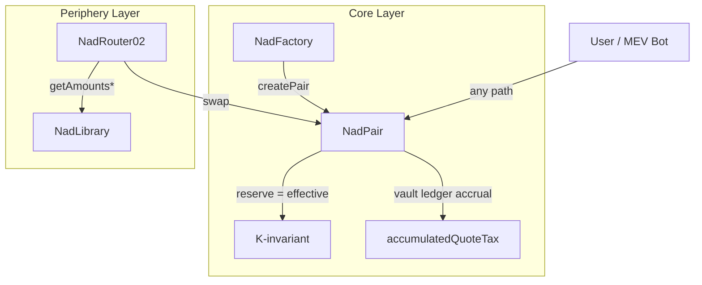

# NadSwap V2 — 최종 구현 명세 (통합본)

> **"0.2% LP 수수료 + 런치별 Quote 전용 거래세 + 가상 Vault + 역산 수학"**  
> Uniswap V2 최소 수정 포크 — 코어 강제 세금 모델

---

## 1. 목표 및 용어

### 목표
- LP 수수료를 **0.2%로 고정** (V2의 0.3%에서 변경)
- **런치별(페어별) 거래세**: `buyTaxBps`, `sellTaxBps`
- 거래세는 **Quote 토큰(WETH, USDT 등)으로만** 적립
- **코어 레벨의 세금 우회 방지** (직접 호출/MEV 포함). 단, 매우 작은 수량에서는 정수 내림(rounding)으로 `tax=0`이 나올 수 있음

### 용어

| 용어 | 정의 |
|------|------|
| **Base** | 런치 토큰(MEME 등) |
| **Quote** | 기축 통화(WETH, USDT 등). 페어당 1개로 고정 |
| **Net** | 사용자가 실제로 수령하는 수량 |
| **Gross** | 세금을 포함한 총 수량 (`Net + Tax`) |
| **Vault** | `accumulatedQuoteTax` — 장부 상 누적 세금 |
| **Effective Balance** | `rawBalance - vault` (quote 측) |
| **Dust** | reserve(및 quote 측은 vault)를 초과한 raw 잔고. 주로 직접 전송/반올림으로 발생하며 `skim`으로 제거 가능 |

---

## 2. 코어 설계 원칙



### 표준 계약 매핑

| 개념 별칭 | 표준 계약 |
|---|---|
| `NadFactory` | `UniswapV2Factory` |
| `NadPair` | `UniswapV2Pair` |
| `NadRouter02` | `UniswapV2Router02` |
| `NadLibrary` | `UniswapV2Library` |

1. **코어 강제(Core Enforcement)**: 모든 세금 로직을 `Pair.swap()` 수학에 내장 → 우회 가능한 대체 경로 없음(직접 호출 포함). 단, 극소 거래는 정수 내림으로 `tax=0` 가능
2. **가상 Vault(Virtual Vault)**: `accumulatedQuoteTax`에 장부 적립 → 스왑마다 ERC20 전송을 생략해 가스 절감
3. **역산 수학(Reverse Math)**: Router가 인용한 Net 수량을 사용자에게 정확히 전달. 내부적으로 Gross를 역산
4. **Reserve = Effective**: reserve 저장/조회는 모두 effective 기준 → TWAP, feeTo, quote 정확성 유지

### 회계 불변식

```
rawQuoteBalance = reserveQuote + accumulatedQuoteTax  (+ dust)
rawBaseBalance  = reserveBase                          (+ dust)
```

> [!IMPORTANT]
> 이 불변식은 Quote 토큰이 **리베이싱/수수료전가(FOT)가 아닐 때만** 성립합니다.
> NadSwap은 프로토콜 레벨에서 **Quote 정책만 온체인 강제**합니다.
> 본 명세 리비전에서는 Base 지원 allowlist를 Factory/Router에서 강제하지 않습니다.
> 운영 정책: `pairAdmin`은 Base를 표준 ERC20(비-FOT/비-리베이싱)으로만 상장해야 하며, 위반 시 swap 실행/UX가 깨질 수 있습니다.

---

## 3. 변경 파일

| 파일 | 범위 | 핵심 변경 |
|------|------|-----------|
| `NadSwapV2Pair.sol` | **높음** | vault, effective balance, 12단계 swap, 세금 설정, claim |
| `INadSwapV2Pair.sol` | 중간 | tax/quote 조회, set, claim 인터페이스 추가 |
| `INadSwapV2Factory.sol` | 중간 | quote 지원 getter(`isQuoteToken`) 유지, base allowlist API 제거 |
| `NadSwapV2Factory.sol` | 중간 | quote 화이트리스트, **pairAdmin 전용 pair 생성**, pair 초기화 (base allowlist 제거) |
| `NadSwapV2Library.sol` | 낮음 | `997→998`, tax-aware getAmounts |
| `NadSwapV2Router02.sol` | 낮음 | 시그니처 유지, **자동 pair 생성 제거**, Library 호출 패치, 토큰 지원 가드, **FOT 지원 swap 변형은 항상 `FOT_NOT_SUPPORTED`로 revert** |

> [!WARNING]
> **Factory ABI 비호환**: `createPair`는 시그니처가 바뀐 `pairAdmin` 전용입니다. Router의 `_addLiquidity` 자동 생성 경로도 제거되었습니다. 기존 V2 툴링과 호환되지 않습니다.

---

## 4. Pair 상태 변수 및 권한

### 추가된 상태 변수

```solidity
// ── Slot 1 (200 bits, 56 bits free) ──
address public quoteToken;             // 160bit — pair 생성 시 고정
uint16  public buyTaxBps;              //  16bit
uint16  public sellTaxBps;             //  16bit
bool    private initialized;           //   8bit

// ── Slot 2 (256 bits perfect packing) ──
address public taxCollector;           // 160bit
uint96  public accumulatedQuoteTax;   //  96bit (Virtual Vault)
// uint96 max ≈ 7.9×10²⁸ — ~79 billion WETH(18 dec), overflow impossible

// ── Constants ──
uint16  constant MAX_TAX_BPS = 2000;   // 최대 20%
uint16  constant BPS = 10_000;
```

### 스토리지 패킹 (2 슬롯)

> [!NOTE]
> Solidity는 **선언 순서**대로 슬롯을 배치합니다. 패킹 보장을 위해 반드시 위 순서 그대로 선언해야 합니다.
> **선언 순서 규칙**: 새 변수는 반드시 V2 원본 상태 변수 뒤에 추가해야 V2 슬롯 오프셋(reserve는 Slot 8 등)을 보존할 수 있습니다.
> NadSwap 추가 필드를 V2 원본 필드(`reserve0`, `reserve1`, `blockTimestampLast`, `price0CumulativeLast`, `price1CumulativeLast`, `kLast`, `unlocked`) 위에 삽입하면 안 됩니다.
> 배포 전 표준 식별자/경로 기준으로 실제 슬롯 레이아웃을 검증하세요.

```
Slot K  : [quoteToken(160)] [buyTaxBps(16)] [sellTaxBps(16)] [initialized(8)] [unused(56)]
Slot K+1: [taxCollector(160)] [accumulatedQuoteTax(96)]  ← 256bit perfect
```

### 스토리지 레이아웃 호환성 게이트 (필수)

```bash
# 프로덕션과 동일한 컴파일러 설정으로 빌드
forge inspect upstream/v2-core/contracts/UniswapV2Pair.sol:UniswapV2Pair storageLayout > /tmp/v2.layout.json
forge inspect protocol/src/core/NadSwapV2Pair.sol:UniswapV2Pair storageLayout > /tmp/nad.layout.json
```

- CI 통과 기준:
- V2 원본 필드(`reserve0`, `reserve1`, `blockTimestampLast`, `price0CumulativeLast`, `price1CumulativeLast`, `kLast`, `unlocked`)의 슬롯/오프셋/타입이 업스트림 V2와 동일해야 함
- NadSwap 추가 필드는 V2 원본 뒤에 append-only여야 함
- V2 원본 필드에서 슬롯/오프셋 drift가 발생하면 릴리스 차단

### 정적 분석 게이트 (CI 필수)

```bash
python3 scripts/gates/check_slither_gate.py
```

- CI 통과 기준:
- Slither가 `protocol/` 대상으로 의존성/테스트 경로 필터링과 함께 실행됨
- 기본값에서 전역 제외 detector 없음 (`SLITHER_EXCLUDE_DETECTORS` 비어있음)
- 제외되지 않은 detector 중 중간 이상 심각도 이슈가 하나라도 있으면 실패 (`SLITHER_FAIL_LEVEL=medium`)

### initialize — 1회 원자적 초기화

```solidity
/// @notice Factory.createPair 내부에서 단 한 번만 호출. 재호출 시 revert.
function initialize(
    address _token0, address _token1, address _quoteToken,
    uint16 _buyTaxBps, uint16 _sellTaxBps, address _taxCollector
) external {
    require(msg.sender == factory, 'FORBIDDEN');
    require(!initialized, 'ALREADY_INITIALIZED');
    require(_quoteToken == _token0 || _quoteToken == _token1, 'INVALID_QUOTE');
    require(_taxCollector != address(0), 'ZERO_COLLECTOR');
    require(_buyTaxBps <= MAX_TAX_BPS && _sellTaxBps <= MAX_TAX_BPS, 'TAX_TOO_HIGH');
    require(_sellTaxBps < BPS, 'SELL_TAX_INVALID');
    initialized = true;
    token0 = _token0;
    token1 = _token1;
    quoteToken = _quoteToken;
    buyTaxBps = _buyTaxBps;
    sellTaxBps = _sellTaxBps;
    taxCollector = _taxCollector;
}
```

### 권한 규칙

| 함수 | 호출자 | 비고 |
|----------|--------|-------|
| `initialize(...)` | `factory` (createPair 내부) | **1회만 허용**, `initialized` 플래그로 재호출 방지 |
| `setTaxConfig(buy, sell, taxCollector)` | `factory` (pairAdmin 경유) | 언제든 변경 가능 |
| `claimQuoteTax(to)` | `taxCollector` | `lock` modifier 적용 |

---

## 5. 수학 정의

### 5.1 LP 수수료 — K 불변식 (V2 원형 구조 유지)

> 정밀도 `1000` 유지. `997→998`만 변경 (0.3%→0.2%)

```
getAmountOut(amountIn, reserveIn, reserveOut):
  amountInWithFee = amountIn × 998
  amountOut = (amountInWithFee × reserveOut) / (reserveIn × 1000 + amountInWithFee)

K-invariant:
  (eff0 × 1000 - in0 × 2) × (eff1 × 1000 - in1 × 2) ≥ reserve0 × reserve1 × 1000²
```

### 5.2 거래세 — 방향별 Quote 세금

**Sell (Base→Quote + quote-output 플래시 경로, Quote가 Output) — 역산 올림(ceil):**
```
quoteOutGross = ⌈ quoteOutNet × BPS / (BPS - sellTaxBps) ⌉
quoteTaxOut   = quoteOutGross - quoteOutNet
```

**Buy (Quote→Base, Quote가 Input) — 선공제 내림(floor):**
```
quoteTaxIn  = ⌊ quoteInRaw × buyTaxBps / BPS ⌋
quoteInNet  = quoteInRaw - quoteTaxIn
```

### 5.3 Effective Balance

```
effectiveQuote = rawQuoteBalance - accumulatedQuoteTax
effectiveBase  = rawBaseBalance    (no vault)
```

**모든 AMM 계산(K, reserve 업데이트, LP 정산, TWAP, feeTo)은 effective 기준을 사용합니다.**

### 5.4 소액 반올림 경계 (Buy Tax)

buy 선공제(`taxIn = floor(rawIn * buyTaxBps / BPS)`)에서는 작은 입력에서 세금이 0이 될 수 있습니다:

```
taxIn = 0  when  rawIn < ceil(BPS / buyTaxBps),  for buyTaxBps > 0
```

이는 세금 우회가 아니라 정수 연산 특성입니다.

---

## 6. Pair.swap() — 12단계 알고리즘

> [!WARNING]
> **동작 비호환성**: 양측 출력(`amount0Out > 0 && amount1Out > 0`)을 거부합니다. V2의 듀얼 출력 플래시 스왑 패턴을 쓰는 통합은 호환되지 않습니다. ABI는 동일하지만 런타임 동작이 다릅니다.

```solidity
function swap(uint amount0Out, uint amount1Out, address to, bytes calldata data) external lock {
```

| 단계 | 설명 | 핵심 코드 |
|------|------|-----------|
| **1** | 기본 검증 | `require(amount0Out > 0 \|\| amount1Out > 0); require(to != token0 && to != token1)` |
| **2** | 단일측 출력 강제 | `require(amount0Out == 0 \|\| amount1Out == 0)` |
| **3** | 유동성 확인(Net 기준) | `require(amount0Out < reserve0 && amount1Out < reserve1)` |
| **4** | Net 전송 + 콜백 | `_safeTransfer(token, to, amountOut); callback()` |
| **5** | Raw 잔고 조회 | `balance = IERC20(token).balanceOf(this)` |
| **6** | oldVault 기반 effective 계산 + drift 가드 | `require(rawQuote >= oldVault, 'VAULT_DRIFT'); effBal = raw - oldVault` |
| **7** | 방향 판정 + **sell** 세금(최종 grossOut) | `if (quoteOut > 0) { grossOut=ceil(...); taxOut=grossOut-netOut; }` |
| **8** | amountIn 계산/검증(effective) + **buy** 세금 | `actualIn(net) validation + amountIn(gross) + buyTaxIn` |
| **9** | newVault 업데이트 | `newVault = oldVault + taxIn + taxOut` |
| **10** | newVault 기준 effective 재계산 + drift 가드 | `require(rawQuote >= newVault, 'VAULT_DRIFT'); eff = raw - newVault` |
| **11** | K 불변식 확인 (998/1000) | `(eff0×1000 - in0×2) × (eff1×1000 - in1×2) ≥ R0×R1×1000²` |
| **12** | 저장: vault + reserve + 이벤트 | `_update(eff0, eff1); emit(effIn0, effIn1)` |

### 7단계: 방향 판정 및 세금 (상세)

```solidity
uint96 oldVault = accumulatedQuoteTax;
uint quoteTaxOut = 0;
uint grossOut    = amountOut;  // default = Net

// ─── Sell (Base→Quote): sellTax, Reverse-Math ───
// Sell tax trigger = quote output event (quoteOut > 0), independent of baseIn
if (quoteOut > 0) {
    // ceil reverse: gross = ⌈net × BPS / (BPS - sellTaxBps)⌉
    grossOut = (quoteOutNet * BPS + (BPS - sellTaxBps) - 1) / (BPS - sellTaxBps);
    require(grossOut < reserveQuote, 'INSUFFICIENT_LIQUIDITY_GROSS');
    quoteTaxOut = grossOut - quoteOutNet;
}
```

**트리거 규칙:** Sell 세금 트리거는 quote 출력 이벤트(`quoteOut > 0`)이며, `baseIn`은 필수 조건이 아닙니다.

**동일 토큰 quote 플래시 경로:** `quoteOut > 0, quoteIn > 0, baseOut = 0, baseIn = 0`
- `sellTaxOut` 적용됨 (quote 출력 트리거)
- `buyTaxIn`은 적용되지 않음 (`baseOut > 0` 조건 미충족)

> Buy 세금은 의도적으로 **8-c 단계**에서 gross 기반 quote input 도출 후 계산합니다.
> 7단계 상세와 전체 의사코드는 동일 트리거 규칙을 따릅니다.

### 8-c 단계: Buy 세금 (상세)

```solidity
uint quoteTaxIn = 0;
if (isQuote0 && amount0In > 0 && amount1Out > 0) {
    quoteTaxIn = amount0In * buyTaxBps / BPS;  // floor
} else if (!isQuote0 && amount1In > 0 && amount0Out > 0) {
    quoteTaxIn = amount1In * buyTaxBps / BPS;  // floor
}
```

### 전체 의사코드

```solidity
function swap(uint amount0Out, uint amount1Out, address to, bytes calldata data) external lock {
    // ── Step 1-2: Validation ──
    require(amount0Out > 0 || amount1Out > 0, 'INSUFFICIENT_OUTPUT');
    require(amount0Out == 0 || amount1Out == 0, 'SINGLE_SIDE_ONLY');
    require(to != token0 && to != token1, 'INVALID_TO'); // V2-compatible safety guard

    // ── Step 3: Liquidity check (Net basis) ──
    (uint112 _r0, uint112 _r1,) = getReserves();  // effective reserves
    require(amount0Out < _r0 && amount1Out < _r1, 'INSUFFICIENT_LIQUIDITY');

    // ── Step 4: Net transfer + callback ──
    if (amount0Out > 0) _safeTransfer(token0, to, amount0Out);
    if (amount1Out > 0) _safeTransfer(token1, to, amount1Out);
    if (data.length > 0) IUniswapV2Callee(to).uniswapV2Call(msg.sender, amount0Out, amount1Out, data);

    // ── Step 5: Raw balance query ──
    uint raw0 = IERC20(token0).balanceOf(address(this));
    uint raw1 = IERC20(token1).balanceOf(address(this));

    // ── Step 6: Effective balance via oldVault ──
    uint96 oldVault = accumulatedQuoteTax;
    bool isQuote0 = (quoteToken == token0);
    uint rawQuote = isQuote0 ? raw0 : raw1;
    require(rawQuote >= oldVault, 'VAULT_DRIFT');
    uint eff0old = isQuote0 ? raw0 - oldVault : raw0;
    uint eff1old = isQuote0 ? raw1 : raw1 - oldVault;

    // ── Step 7: Direction detection + sell tax (finalize grossOut) ──
    uint grossAmount0Out = amount0Out;
    uint grossAmount1Out = amount1Out;
    uint quoteTaxOut = 0;
    uint quoteTaxIn = 0;

    // Sell: quote-output path (including Base→Quote) → Reverse-Math
    if (isQuote0 && amount0Out > 0) {
        // token0=quote is output = sell
        grossAmount0Out = (amount0Out * BPS + (BPS - sellTaxBps) - 1) / (BPS - sellTaxBps);
        require(grossAmount0Out < _r0, 'INSUFFICIENT_LIQUIDITY_GROSS');
        quoteTaxOut = grossAmount0Out - amount0Out;
    } else if (!isQuote0 && amount1Out > 0) {
        // token1=quote is output = sell
        grossAmount1Out = (amount1Out * BPS + (BPS - sellTaxBps) - 1) / (BPS - sellTaxBps);
        require(grossAmount1Out < _r1, 'INSUFFICIENT_LIQUIDITY_GROSS');
        quoteTaxOut = grossAmount1Out - amount1Out;
    }

    // ── Step 8-a: Actual user input validation (Net-based, prevent phantom input) ──
    uint actualIn0 = eff0old > (_r0 - amount0Out) ? eff0old - (_r0 - amount0Out) : 0;
    uint actualIn1 = eff1old > (_r1 - amount1Out) ? eff1old - (_r1 - amount1Out) : 0;
    require(actualIn0 > 0 || actualIn1 > 0, 'INSUFFICIENT_INPUT');

    // ── Step 8-b: Gross-based amountIn (for tax accounting) ──
    uint amount0In = eff0old > (_r0 - grossAmount0Out) ? eff0old - (_r0 - grossAmount0Out) : 0;
    uint amount1In = eff1old > (_r1 - grossAmount1Out) ? eff1old - (_r1 - grossAmount1Out) : 0;

    // ── Step 8-c: Buy tax calculation (Quote in, Base out → Pre-Deduction) ──
    if (isQuote0 && amount0In > 0 && amount1Out > 0) {
        quoteTaxIn = amount0In * buyTaxBps / BPS;
    } else if (!isQuote0 && amount1In > 0 && amount0Out > 0) {
        quoteTaxIn = amount1In * buyTaxBps / BPS;
    }

    // ── Step 9: newVault update (overflow protection, uint96) ──
    uint256 _nv = uint256(oldVault) + quoteTaxIn + quoteTaxOut;
    require(_nv <= type(uint96).max, 'VAULT_OVERFLOW');
    uint96 newVault = uint96(_nv);

    // ── Step 10: Effective balance re-calc with newVault ──
    require(rawQuote >= newVault, 'VAULT_DRIFT');
    uint eff0 = isQuote0 ? raw0 - newVault : raw0;
    uint eff1 = isQuote0 ? raw1 : raw1 - newVault;

    // Re-calc effective amountIn (reflects buy tax deduction)
    uint effIn0 = eff0 > (_r0 - grossAmount0Out) ? eff0 - (_r0 - grossAmount0Out) : 0;
    uint effIn1 = eff1 > (_r1 - grossAmount1Out) ? eff1 - (_r1 - grossAmount1Out) : 0;

    // ── Step 11: K-invariant (998/1000 = 0.2% LP fee) ──
    {
        uint adj0 = eff0 * 1000 - effIn0 * 2;
        uint adj1 = eff1 * 1000 - effIn1 * 2;
        require(adj0 * adj1 >= uint(_r0) * uint(_r1) * (1000 ** 2), 'K');
    }

    // ── Step 12: Store ──
    accumulatedQuoteTax = newVault;
    _update(eff0, eff1, _r0, _r1);    // ← effective basis!

    // Event: uses effective input after newVault (accounting-consistent)
    emit Swap(msg.sender, effIn0, effIn1, amount0Out, amount1Out, to);
    emit QuoteTaxAccrued(quoteTaxIn, quoteTaxOut, newVault);
}
```

---

## 7. mint / burn / skim / sync

모든 경로는 **effective balance**를 사용합니다.

> [!IMPORTANT]
> 모든 effective-balance 경로(`swap/mint/burn/sync`)에서 quote 측 차감 전에 반드시:
> `require(rawQuote >= accumulatedQuoteTax, 'VAULT_DRIFT')`.
> 이는 `rawQuote < vault` 상태를 막는 라이브니스 가드입니다.

| 함수 | 변경 지점 |
|------|-----------|
| **mint** | `amount = effBalance - reserve` (유동성 증가 계산에서 vault 제외) |
| **burn** | LP 비례 출금은 `effBalance` 기준 계산 (vault는 LP 자산이 아님) |
| **skim** | 방어적 초과분 계산(아래 참고) |
| **sync** | `_update(effBalance0, effBalance1, ...)` |

**`skim` 방어 패턴** (언더플로우 방지):
```solidity
// quote side: safe even if raw < reserve + vault
uint256 expectedQuote = uint256(reserveQuote) + accumulatedQuoteTax;
uint256 excessQuote = rawQuote > expectedQuote ? rawQuote - expectedQuote : 0;
if (excessQuote > 0) _safeTransfer(quoteToken, to, excessQuote);

// base side: same as original
uint256 excessBase = rawBase > reserveBase ? rawBase - reserveBase : 0;
if (excessBase > 0) _safeTransfer(baseToken, to, excessBase);
```

---

## 8. claimQuoteTax

```solidity
/// @notice taxCollector만 호출 가능. 재진입 방지 필요.
function claimQuoteTax(address to) external lock {
    require(msg.sender == taxCollector, 'FORBIDDEN');
    require(to != address(0) && to != address(this), 'INVALID_TO');  // burn + self-transfer 방지
    uint96 taxAmount = accumulatedQuoteTax;
    require(taxAmount > 0, 'NO_TAX');
    uint rawQuote = IERC20(quoteToken).balanceOf(address(this));
    require(rawQuote >= taxAmount, 'VAULT_DRIFT');
    
    accumulatedQuoteTax = 0;
    _safeTransfer(quoteToken, to, uint(taxAmount));

    // claim은 reserve를 업데이트하지 않음(dust는 skim 가능 상태 유지)
    emit QuoteTaxClaimed(to, taxAmount);
}
```

> [!NOTE]
> claim은 reserve를 재동기화하지 않습니다. claim 시점 quote dust는 dust로 남고 `skim`으로 회수할 수 있습니다.

---

## 9. 세금 설정(Tax Config)

```solidity
/// @notice 세율 + taxCollector 설정. pairAdmin은 언제든 변경 가능.
function setTaxConfig(uint16 _buyTaxBps, uint16 _sellTaxBps, address _taxCollector) external {
    require(msg.sender == factory, 'FORBIDDEN');
    require(_buyTaxBps <= MAX_TAX_BPS && _sellTaxBps <= MAX_TAX_BPS, 'TAX_TOO_HIGH');
    require(_sellTaxBps < BPS, 'SELL_TAX_INVALID');
    require(_taxCollector != address(0), 'ZERO_COLLECTOR');
    buyTaxBps = _buyTaxBps;
    sellTaxBps = _sellTaxBps;
    taxCollector = _taxCollector;
    emit TaxConfigUpdated(_buyTaxBps, _sellTaxBps, _taxCollector);
}
```

---

## 10. Factory 변경

> [!IMPORTANT]
> **`createPair`는 `pairAdmin` 전용**입니다. 무허가 생성을 막아 pair 선점(front-running)을 방지하고, 세금 설정을 원자적으로 초기화해 무세금 거래 구간을 차단합니다.

> [!WARNING]
> **Factory ABI 비호환**: 원래 `createPair(address,address)` 시그니처를 보존하지 않습니다. Router의 `_addLiquidity` 자동 생성 경로도 제거됩니다.

```solidity
// ── Added State ──
mapping(address => bool) public isQuoteToken;
mapping(address => bool) public isPair;
address public pairAdmin;

/// @notice pairAdmin은 배포 시 고정됨 (이 명세의 거버넌스 선택)
constructor(address _pairAdmin) public {
    require(_pairAdmin != address(0), 'ZERO_ADDRESS');
    pairAdmin = _pairAdmin;
}

/// @notice Quote 화이트리스트 등록. 리베이싱/FOT 토큰은 허용하지 않음.
/// @dev 리베이싱/FOT는 vault 회계 불변식(raw=reserve+vault)을 깨뜨림.
function setQuoteToken(address token, bool enabled) external {
    require(msg.sender == pairAdmin, 'FORBIDDEN');
    require(token != address(0), 'ZERO_ADDRESS');
    isQuoteToken[token] = enabled;
}

/// @notice feeTo 수령자 변경 (V2 semantics 유지, 관리자만 pairAdmin으로 통합)
function setFeeTo(address _feeTo) external {
    require(msg.sender == pairAdmin, 'UniswapV2: FORBIDDEN');
    feeTo = _feeTo;
}

/// @dev Pair 무결성 확인 — 매핑으로 이 Factory 생성 여부 검증(외부 호출 없음)
modifier onlyValidPair(address pair) {
    require(isPair[pair], 'INVALID_PAIR');
    _;
}

/// @notice pairAdmin 전용 — Pair 생성 + Tax 원자적 초기화
/// @dev 무허가 생성이 아님. pair 선점 + 무세금 구간 방지.
function createPair(
    address tokenA,
    address tokenB,
    uint16 buyTaxBps,
    uint16 sellTaxBps,
    address taxCollector
) external returns (address pair) {
    require(msg.sender == pairAdmin, 'FORBIDDEN');  // ← access control
    // ... 기존 정렬 & 검증 ...
    
    // Quote-Quote 페어 금지
    require(!(isQuoteToken[token0] && isQuoteToken[token1]), 'BOTH_QUOTE');
    
    // Quote 식별
    address qt;
    if (isQuoteToken[token0]) qt = token0;
    else if (isQuoteToken[token1]) qt = token1;
    else revert('QUOTE_REQUIRED');

    // ... CREATE2 ...
    
    // 원자적 초기화: tokens + Quote + Tax 동시 설정
    IUniswapV2Pair(pair).initialize(token0, token1, qt, buyTaxBps, sellTaxBps, taxCollector);
    isPair[pair] = true;   // 무결성 매핑 등록
    // ... mapping storage ...
}

// Tax 설정 변경 (pairAdmin 경유, pair 무결성 검증)
function setTaxConfig(address pair, uint16 buy, uint16 sell, address taxCollector) external onlyValidPair(pair) {
    require(msg.sender == pairAdmin, 'FORBIDDEN');
    IUniswapV2Pair(pair).setTaxConfig(buy, sell, taxCollector);
}
```

### Router `_addLiquidity` 패치

```diff
 // UniswapV2Router02._addLiquidity
-if (IUniswapV2Factory(factory).getPair(tokenA, tokenB) == address(0)) {
-    IUniswapV2Factory(factory).createPair(tokenA, tokenB);
-}
+require(IUniswapV2Factory(factory).getPair(tokenA, tokenB) != address(0), 'PAIR_NOT_CREATED');
```

> Router는 pair를 자동 생성하지 않습니다. `pairAdmin`이 먼저 `createPair`로 생성해야 합니다.

### Router FOT 정책

> [!WARNING]
> NadSwap은 Router 실행 경로에서 FOT(수수료전가)·리베이싱 동작을 **지원하지 않습니다**.
> 프로토콜의 온체인 지원 가드는 Quote(`isQuoteToken`)에만 적용되며 Base는 온체인 allowlist가 없습니다.
> Router 외부 시그니처는 유지됩니다.  
> `swapExactTokensForTokensSupportingFeeOnTransferTokens` 계열 함수는 반드시 `FOT_NOT_SUPPORTED`로 hard-revert 해야 합니다.
> 운영 정책을 어기고 Base-FOT 페어를 생성하면, sell exact-in은 revert될 수 있고 buy exact-in은 Router quote 대비 사용자 실수령이 부족해질 수 있습니다.

**Router 지원 가드 (swap/add-liquidity 경로 필수):**
```solidity
function _requireSupportedPairTokens(address pair) internal view {
    address qt = IUniswapV2Pair(pair).quoteToken();
    require(IUniswapV2Factory(factory).isQuoteToken(qt), 'QUOTE_NOT_SUPPORTED');
}
```

---

## 11. Library 패치

### getAmountOut / getAmountIn (LP 수수료 0.2%)

```diff
-uint amountInWithFee = amountIn * 997;
-uint denominator = reserveIn * 1000 + amountInWithFee;
+uint amountInWithFee = amountIn * 998;
+uint denominator = reserveIn * 1000 + amountInWithFee;
```

```diff
-uint numerator = reserveIn * amountOut * 1000;
-uint denominator = (reserveOut - amountOut) * 997;
+uint numerator = reserveIn * amountOut * 1000;
+uint denominator = (reserveOut - amountOut) * 998;
```

### `pairFor` 구현 (INIT_CODE_HASH 하드코딩 없음)

```solidity
function pairFor(address factory, address tokenA, address tokenB) internal view returns (address pair) {
    pair = IUniswapV2Factory(factory).getPair(tokenA, tokenB);
    require(pair != address(0), 'PAIR_NOT_FOUND');
}
```

> [!IMPORTANT]
> 온체인 라우팅은 Factory 매핑 조회(`getPair`)를 사용하며, 하드코딩된 `INIT_CODE_HASH`에 의존하지 않습니다.
> Pair 바이트코드 변경 시 주소 파생 드리프트를 피할 수 있습니다.

### getAmountsOut / getAmountsIn — 세금 인지형 (4방향 규칙)

| 경로 | 방향 | 반올림 | 공식 |
|------|------|--------|------|
| exact-in, Quote→Base (buy) | 입력 선공제 | **floor** | `tax = rawIn × buyTax / BPS` (floor), `effIn = rawIn - tax` → `getAmountOut(effIn)` |
| exact-in, Base→Quote (sell) | 출력 후공제(실행 안전) | **floor** | `grossOut = getAmountOut(baseIn)`, `netOutSafe = floor((grossOut-1) × (BPS-sellTax) / BPS)` when `grossOut > 0` |
| exact-out, Base→Quote (sell) | 역산 gross-up | **ceil** | `grossOut = ⌈netOut × BPS / (BPS-sellTax)⌉` → `getAmountIn(grossOut)` |
| exact-out, Quote→Base (buy) | 역산 gross-up | **ceil** | `netIn = getAmountIn(baseOut)` → `rawIn = ⌈netIn × BPS / (BPS-buyTax)⌉` |

> Sell exact-in 참고: Library의 `grossOut`(floor)과 Pair 재구성 `grossOut`(reverse ceil)은 최대 `1 wei` 차이날 수 있습니다 (`test_sell_exactIn_grossOut_diverge`).
> 권장 Router quote는 sell 안전 마진 1 wei(`grossOut-1`)를 사용해 유동성 경계 revert를 줄입니다.

> **반올림 원칙**:
> - **exact-in**: buy 입력세 공제는 **floor**(Pair 정렬), 사용자 출력도 **floor**
> - **exact-out**: 사용자 필요 입력과 gross-up은 **ceil**

**ceil 구현 패턴:**
```solidity
function ceilDiv(uint a, uint b) internal pure returns (uint) {
    return (a + b - 1) / b;
}
```

```solidity
// ── getAmountsOut (exact-in) ──
function getAmountsOut(uint amountIn, address[] memory path) public view returns (uint[] memory amounts) {
    amounts = new uint[](path.length);
    amounts[0] = amountIn;
    for (uint i; i < path.length - 1; i++) {
        address pair = pairFor(factory, path[i], path[i+1]);
        (uint rIn, uint rOut) = getReserves(factory, path[i], path[i+1]);
        address qt = IUniswapV2Pair(pair).quoteToken();
        
        uint effIn = amounts[i];
        if (path[i] == qt) {  // buy: match Pair operation order (compute tax first, then subtract)
            uint16 buyTax = IUniswapV2Pair(pair).buyTaxBps();
            uint tax = effIn * buyTax / BPS;   // floor
            effIn = effIn - tax;
        }
        uint grossOut = getAmountOut(effIn, rIn, rOut);   // floor (V2 original)
        amounts[i+1] = grossOut;
        if (path[i+1] == qt) {  // sell: execution-safe quote with 1 wei margin
            uint16 sellTax = IUniswapV2Pair(pair).sellTaxBps();
            amounts[i+1] = grossOut > 0
                ? (grossOut - 1) * (BPS - sellTax) / BPS  // floor
                : 0;
        }
    }
}

// ── getAmountsIn (exact-out) ──
function getAmountsIn(uint amountOut, address[] memory path) public view returns (uint[] memory amounts) {
    amounts = new uint[](path.length);
    amounts[amounts.length - 1] = amountOut;
    for (uint i = path.length - 1; i > 0; i--) {
        address pair = pairFor(factory, path[i-1], path[i]);
        (uint rIn, uint rOut) = getReserves(factory, path[i-1], path[i]);
        address qt = IUniswapV2Pair(pair).quoteToken();
        
        uint targetOut = amounts[i];
        if (path[i] == qt) {  // sell: net→gross ceil reverse
            uint16 sellTax = IUniswapV2Pair(pair).sellTaxBps();
            targetOut = ceilDiv(targetOut * BPS, BPS - sellTax);  // ceil
        }
        amounts[i-1] = getAmountIn(targetOut, rIn, rOut);  // ceil (V2 original +1)
        if (path[i-1] == qt) {  // buy: net→raw ceil reverse
            uint16 buyTax = IUniswapV2Pair(pair).buyTaxBps();
            amounts[i-1] = ceilDiv(amounts[i-1] * BPS, BPS - buyTax);  // ceil
        }
    }
}
```

> [!NOTE]
> Router 외부 시그니처는 유지됩니다. 미지원 FOT 스타일 변형은 런타임에서 `FOT_NOT_SUPPORTED`로 revert 됩니다.

---

## 12. 이벤트

```solidity
event TaxConfigUpdated(uint16 buyTaxBps, uint16 sellTaxBps, address taxCollector);
event QuoteTaxAccrued(uint256 quoteTaxIn, uint256 quoteTaxOut, uint256 accumulatedQuoteTax);
event QuoteTaxClaimed(address indexed to, uint256 amount);
```

---

## 13. 보안 체크리스트

| # | 항목 | 검증 | 비고 |
|---|------|------|------|
| 1 | K 불변식 무결성 | effective 기반 998/1000 | |
| 2 | 입력 이중계산 방지 | oldVault 기준 effective balance | |
| 3 | feeTo/TWAP 일관성 | reserve=effective 저장 | |
| 4 | ceil 역산(sell) | `ceilDiv(net*BPS, BPS-tax)` | |
| 5 | grossOut 유동성 확인 | `require(grossOut < reserve)` | |
| 6 | claim 재진입 | `lock` modifier | |
| 7 | 단일측 출력 | `require(one side == 0)` | 동작 비호환성 문서화 |
| 8 | 세금 상한 | `MAX_TAX_BPS`, `sellTax < BPS` | |
| 9 | 즉시 세금 변경 | pairAdmin이 언제든 setTaxConfig 호출 가능 | |
| 10 | 회계 불변식 | `raw = reserve + vault + dust` | pair 토큰이 지원 정책(비리베이싱/비FOT)을 만족할 때 유지 |
| 11 | 샌드위치 보호 | Router `amountOutMin` 유지 | |
| 12 | 직접 호출 방어 | 코어 내장 세금으로 자동 방어 | |
| 13 | 무세금 구간 방지 | createPair 시 세금 원자적 초기화 | |
| 14 | Swap 이벤트 회계 일치 | effIn(newVault 반영) emitted | |
| 15 | setTaxConfig 통합 관리 | 세율 + taxCollector를 단일 함수로 관리 | |
| 16 | Pair 선점 방지 | createPair는 pairAdmin 전용 | |
| 17 | Vault 오버플로우 보호 | `require(nv <= type(uint96).max)` | uint96 안전성 확인 |
| 18 | Initialize 재호출 방지 | `initialized` 플래그 + 입력 검증 | |
| 19 | Router 자동 생성 제거 | pair 없으면 `_addLiquidity` revert | |
| 20 | setTaxConfig zero taxCollector | `require(_taxCollector != address(0))` | |
| 21 | Factory pair 무결성 | `isPair[pair]` 매핑 확인(외부 호출 없음) | |
| 22 | 🆕 SafeERC20 사용 | `_safeTransfer` (V2 원형 패턴) | 비표준 토큰(USDT 등) 호환 |
| 23 | 🆕 최초 예치자 인플레이션 가드 | V2 `MINIMUM_LIQUIDITY` 1000 소각 | 초기 공급 시 LP 지분 조작 방지 |
| 24 | 🆕 CEI 순서 안전성 | claim: vault=0(E) → transfer(I) | `lock` 하에서 안전, 외부 호출 전 vault 초기화 |
| 25 | 🆕 claimQuoteTax 인센티브 설계 | taxCollector가 직접 호출(자산 회수) | 제3자 인센티브 불필요 |
| 26 | 🆕 ERC20 반환값 검사 | `_safeTransfer` 내부 `require(success)` | bool 미반환 토큰 처리 |
| 27 | 🆕 Router FOT 미지원 강제 | FOT 스타일 Router 변형은 항상 `FOT_NOT_SUPPORTED`; Quote 가드는 온체인 유지 | ABI 호환성을 유지하면서 미지원 실행 경로를 명시 차단 |
| 28 | 🆕 라우팅에서 INIT_CODE_HASH 비의존 | `pairFor`가 `factory.getPair` 사용 | create2 해시 드리프트 위험 제거 |
| 29 | 🆕 quote out은 항상 sellTax 과세 | `quoteOut > 0`이면 sellTax 적용 (`baseIn == 0` 포함) | 동일 토큰 quote flash(out/in) 우회 해석 방지 |
| 30 | 🆕 Vault drift 라이브니스 가드 | quote 측 차감 전 `require(rawQuote >= vault, 'VAULT_DRIFT')` | 전 생명주기 경로에서 무음 언더플로우성 라이브니스 손실 방지 |
| 31 | 🆕 swap 대상 하드닝 | `require(to != token0 && to != token1, 'INVALID_TO')` | V2 호환 안전 동작 복원 |
| 32 | 🆕 Base allowlist 제거 | Factory/Router가 base allowlist를 더 이상 강제하지 않음 | Base 정책은 운영 강제(pairAdmin 표준 ERC20 한정), Quote 정책은 프로토콜 강제 유지 |
| 33 | 🆕 sell exact-in 안전 마진 quote | Router quote는 sell 세금 공제 전 `grossOut-1` 사용 | 유동성 경계 실행 revert 감소(최대 1 wei 보수적) |
| 34 | 🆕 claim dust 동작 문서화 | claim은 reserve를 유지하고 quote dust는 skim 가능 상태로 남김 | 통합자 대상 운영/회계 의미 명확화 |
| 35 | 🆕 K 곱셈 오버플로우 처리 | 선택적 가드(`adj0 == 0 || adj1 <= max/adj0`) 또는 토큰 정책 문서화 | 핵심 익스플로잇 경로는 아니며 정보성 하드닝. 현재 구현은 명시 가드를 채택 |

---

## 14. 가스 최적화

| 최적화 | 절감 | 설명 |
|-------|------|------|
| Virtual Vault | ~21,000 gas/swap | ERC20 전송 제거 |
| 스토리지 패킹 | ~10,000 gas | 3→2 슬롯 압축(uint96 vault). `forge inspect` 검증 필수 |
| LP 수수료 정밀도 1000 | ~200 gas | V2 원형 곱셈 구조 유지 |
| 배치 claim | N/A | 여러 블록 적립 후 단일 수령 |

---

## 15. 설계 결정 (확정)

| # | 결정 | 근거 |
|---|------|------|
| Q1 | buyTax = 선공제(Pre-Deduction) | AMM/세금 완전 분리. Virtual Vault 자동 통합. sell 역산과 대칭 |
| Q2 | feeTo 활성화 | V2 `_mintFee` 유지. effective reserve 기준 순수 LP 수수료 성장만 포착 |
| Q3 | **코드는 tax=0 허용, 거버넌스는 tax≥1 bps 권장** | 코드상 최소치 강제 없음. 경계 안전성 보장. 최소세는 거버넌스 레이어에서 관리 |
| Q4 | Quote-Quote 페어 금지 | `BOTH_QUOTE` revert. 페어당 Quote는 정확히 1개 |
| Q5 | 멀티홉 = 페어별 독립 과세 | 코어 독립성 유지. 대부분 1-hop 거래. 추가 로직 불필요 |
| Q6 | LP 수수료 = 0.2% 고정 | `997→998`만 변경. 페어별 가변 수수료 불필요 |
| Q7 | LP 수수료 정밀도 = 1000 | V2 원형 K 불변식 구조 유지. 최소 수정 원칙 |
| Q8 | 동결 없음 | pairAdmin이 세율/taxCollector를 언제든 변경 가능. 운영 유연성 우선 |
| Q9 | 듀얼 출력 거부 | SINGLE_SIDE_ONLY 강제. 플래시 스왑 듀얼 출력 패턴 미지원(비호환성 문서화) |
| Q10 | pairAdmin은 배포 후 불변 | 이 명세에는 `setPairAdmin` 없음. 관리자 역할은 배포 시 설정으로 고정 |
| Q11 | Router sell exact-in은 1 wei 안전 마진 사용 | gross 유동성 경계 근처 실행 성공률 향상. 사용자 quote는 최대 1 wei 보수적일 수 있음 |
| Q12 | claim은 quote dust를 reserve에 흡수하지 않음 | claim은 tax vault 인출만 수행하며, dust는 명시적 reserve 업데이트 경로 전까지 `skim`으로 제거 가능 |
| Q13 | K 곱셈 오버플로우는 정보성 하드닝으로 취급 | 명시 가드 또는 토큰 공급 정책 문서화 선택 가능. 기본 설계 정합성에는 필수 아님. 현재 구현은 명시 가드 사용 |

---

## 16. 테스트 명세 (Foundry)

### Unit — Pair.swap() 코어 수학

| 테스트 | 검증 |
|------|------|
| `test_sell_reverseMath_ceilGross` | ceil 역산 확인 → `taxOut = gross - net > 0` |
| `test_buy_preDeduction_taxIn` | `taxIn = rawIn × buyTax / BPS` 정확성 |
| `test_directCall_cannotBypassTax` | Router를 우회한 직접 swap도 동일하게 과세 |
| `test_quoteFlash_sameToken_sellTax_applies` | 🆕 동일 토큰 quote flash(out→callback in) 경로에서 `quoteTaxOut > 0` |
| `test_quoteFlash_sameToken_noBypass_coreTax` | 🆕 직접 호출 + 콜백 경로로도 코어 세금 우회 불가 |
| `test_quoteFlash_sameToken_buyTax_notApplied_when_noBaseOut` | 🆕 `baseOut=0`일 때 buyTax 미적용 |
| `test_quoteFlash_sameToken_kInvariant_holds_after_tax` | 🆕 동일 토큰 quote flash 과세 후 K 불변식 유지 |
| `test_swapEvent_usesEffIn` | Swap 이벤트 amountIn = effIn(newVault 반영) |
| `test_swap_invalidTo_revert` | `to == token0 || to == token1`이면 INVALID_TO revert |
| `test_singleSideOnly_revert` | 듀얼 출력 요청 revert |
| `test_singleSide_swapExactTokens` | `swapExactTokensForTokens` 경로에서 듀얼 출력 불가 |
| `test_singleSide_swapForExactTokens` | `swapTokensForExactTokens` 경로에서 듀얼 출력 불가 |
| `test_singleSide_flashCallback` | 플래시 콜백 경로도 동일하게 revert |
| `test_vaultOverflow_revert` | 극단적 적립 시 VAULT_OVERFLOW revert |
| `test_sell_exactIn_grossOut_diverge` | sell exact-in에서 Library grossOut vs Pair grossOut ±1 wei 방향성 확인 |
| `test_sell_exactIn_liquidityEdge` | 코어 swap 가드: `grossOut_pair = reserve`면 Pair revert (`INSUFFICIENT_LIQUIDITY_GROSS`) |
| `test_swap_zeroInput_revert` | 🆕 토큰 입력 없이 swap 호출 → INSUFFICIENT_INPUT revert |
| `test_swap_insufficientLiquidity` | 🆕 amountOut > reserve → INSUFFICIENT_LIQUIDITY revert |
| `test_swap_bothZeroOut_revert` | 🆕 amount0Out=0, amount1Out=0 → INSUFFICIENT_OUTPUT revert |
| `test_sell_grossOut_exceedsReserve` | 🆕 높은 sellTax로 grossOut > reserve면 revert |
| `test_swap_vaultDrift_oldVault_revert` | 🆕 effective 차감 전 `rawQuote < oldVault`이면 VAULT_DRIFT revert |
| `test_swap_vaultDrift_newVault_revert` | 🆕 10단계 재계산 전 `rawQuote < newVault`이면 VAULT_DRIFT revert |
| `test_buy_sell_sequential` | 🆕 동일 페어 연속 buy→sell 시 vault 적립 정확성 |
| `test_kInvariant_afterTaxedSwap` | 🆕 과세 swap 후 effective reserve K ≥ K_prev |

### Unit — mint / burn / skim / sync

| 테스트 | 검증 |
|------|------|
| `test_mint_excludesVault` | LP 추가 계산에서 vault 제외 |
| `test_burn_excludesVault` | LP 제거 계산에서 vault 제외 |
| `test_mint_afterSwap_vaultIntact` | 🆕 swap 후 mint(vault 적립 상태) — vault 불변, 유동성 정확히 추가 |
| `test_burn_afterSwap_vaultIntact` | 🆕 swap 후 burn(vault 적립 상태) — vault 제외, LP 비례 정산 정확 |
| `test_skim_underflow_safe` | 🆕 raw < reserve + vault에서도 skim revert 없음(방어 패턴) |
| `test_skim_excessDust_transfer` | 🆕 외부 토큰 전송(dust) 후 초과분 skim 정상 전송 |
| `test_sync_withVault_usesEffective` | 🆕 `vault > 0`에서 sync는 effective reserve 저장(quote 측 `raw - vault`) |
| `test_sync_afterClaim` | 🆕 claim 후 sync → reserve = raw(vault=0) 정상 동기화 |
| `test_mint_vaultDrift_revert` | 🆕 `rawQuote < vault`면 mint가 VAULT_DRIFT revert |
| `test_burn_vaultDrift_revert` | 🆕 `rawQuote < vault`면 burn이 VAULT_DRIFT revert |
| `test_sync_vaultDrift_revert` | 🆕 `rawQuote < vault`면 sync가 VAULT_DRIFT revert |

### Unit — claimQuoteTax

| 테스트 | 검증 |
|------|------|
| `test_claim_vaultReset_reserveSync` | claim 후 `vault=0`, reserve 불변, 수령 토큰 수량 일치 |
| `test_claim_doesNotAbsorbDust` | 🆕 quote dust는 claim 후에도 reserve에 편입되지 않고 skim으로 회수 가능 |
| `test_claim_selfTransfer_revert` | 🆕 `to=address(this)` → INVALID_TO revert( vault donation 방지) |
| `test_claim_zeroAddress_revert` | 🆕 `to=address(0)` → INVALID_TO revert |
| `test_claim_noTax_revert` | 🆕 vault=0에서 claim → NO_TAX revert |
| `test_claim_nonTaxCollector_revert` | 🆕 taxCollector가 아닌 주소 → FORBIDDEN revert |
| `test_claim_reentrancy_blocked` | 🆕 lock modifier로 재진입 차단 |
| `test_claim_vaultDrift_revert` | 🆕 `rawQuote < vault`면 claim이 VAULT_DRIFT revert |

### Unit — Tax Config (§9)

| 테스트 | 검증 |
|------|------|
| `test_setTaxConfig_alwaysMutable` | pairAdmin이 세율을 언제든 변경 가능 |
| `test_setTaxConfig_zeroTaxCollector` | taxCollector=0으로 setTaxConfig 호출 시 revert |
| `test_setTaxConfig_maxTax_revert` | 🆕 buyTax/sellTax > MAX_TAX_BPS(2000) → TAX_TOO_HIGH revert |
| `test_setTaxConfig_sellTax100pct_revert` | 🆕 sellTax = BPS(10000) → TAX_TOO_HIGH revert(최대세 가드 우선) |
| `test_setTaxConfig_nonFactory_revert` | 🆕 non-factory 주소에서 직접 호출 → FORBIDDEN revert |
| `test_taxChange_raceCond_slippage` | 세금 변경 후 quote 기준 swap에서 `amountOutMin` 슬리피지 revert |

### Unit — Factory (§10)

| 테스트 | 검증 |
|------|------|
| `test_createPair_onlyPairAdmin` | 비인가 호출자 revert |
| `test_createPair_frontRunBlocked` | 다른 주소의 선점 시도 revert |
| `test_createPair_bothQuote_revert` | 🆕 Quote-Quote 페어 생성 → BOTH_QUOTE revert |
| `test_createPair_noQuote_revert` | 🆕 두 토큰 모두 Quote 아님 → QUOTE_REQUIRED revert |
| `test_createPair_unlistedBase_success` | 🆕 Base allowlist 등록 없이도 quote 조건 충족 시 pair 생성 성공 |
| `test_createPair_duplicate_revert` | 🆕 중복 페어 생성 revert |
| `test_factory_invalidPair_revert` | 외부 pair 주소 대상 Factory admin 함수 호출 revert |
| `test_setQuoteToken_zeroAddr_revert` | 🆕 address(0)로 setQuoteToken → ZERO_ADDRESS revert |
| `test_setQuoteToken_nonPairAdmin_revert` | 🆕 non-pairAdmin가 setQuoteToken 호출 → FORBIDDEN revert |
| `test_baseAllowlistApi_setter_removed` | 🆕 low-level `setBaseTokenSupported(address,bool)` 호출 실패(셀렉터 제거) |
| `test_baseAllowlistApi_getter_removed` | 🆕 low-level `isBaseTokenSupported(address)` 호출 실패(셀렉터 제거) |
| `test_setFeeTo_onlyPairAdmin_revert` | 🆕 non-pairAdmin가 setFeeTo 호출 → UniswapV2: FORBIDDEN revert |
| `test_setFeeTo_pairAdmin_success` | 🆕 pairAdmin이 feeTo를 정상 갱신 가능 |
| `test_constructor_zeroAddress_revert` | 🆕 생성자 `pairAdmin`이 0이면 ZERO_ADDRESS revert |
| `test_initialize_reentryBlocked` | initialize 2회 호출 시 revert |
| `test_initialize_zeroTaxCollector` | taxCollector=0이면 revert |
| `test_initialize_invalidQuote` | 🆕 quoteToken이 token0/token1과 불일치 → INVALID_QUOTE revert |
| `test_initialize_taxTooHigh_revert` | 🆕 initialize 시 buyTax/sellTax > MAX_TAX_BPS(2000) → TAX_TOO_HIGH revert |
| `test_initialize_sellTax100pct_revert` | 🆕 initialize 시 sellTax = BPS(10000) → TAX_TOO_HIGH revert(최대세 가드 우선) |
| `test_atomicInit_noTaxFreeWindow` | `createPair` + 세금 원자 초기화로 첫 swap부터 과세 |
| `test_pairAdmin_immutable` | 🆕 pairAdmin 역할은 불변(이 명세엔 이전 경로 없음) |

### Unit — Library / Router Quoting (§11)

**Group A — 실행 가능 경로 패리티 (`error <= 1 wei`)**

| 테스트 | 검증 |
|------|------|
| `test_routerQuote_matchesExecution` | 실행 가능한 swap에서 Router quote와 실제 Net 수령 일치(오차 ≤ 1 wei) |
| `test_getAmountsIn_ceilRounding` | exact-out 경로 ceil 반올림 → 프로토콜 우호적 |
| `test_rounding_boundary_1wei` | Router netOut(floor) ↔ Core grossOut(ceil) 경계 1 wei 허용 오차 확인 |
| `test_library_buyTax_matchesPair` | 🆕 Library buy 공제(`tax=effIn*tax/BPS; effIn-=tax`)가 다양한 수량에서 Pair 동작과 일치 |
| `test_library_multihop_taxPerHop` | 🆕 A→B→C 2-hop에서 홉별 독립 과세, 누적 오차 ≤ 2 wei |
| `test_library_getAmountsIn_buyGrossUp` | 🆕 exact-out buy의 ceil 역산 rawIn에서 Pair effIn ≥ netIn 검증 |
| `test_library_lpFee_998` | 🆕 LP 수수료가 0.2%(998/1000)이며 V2 0.3%(997)와 구분됨 |
| `test_pairFor_usesFactoryGetPair` | 🆕 `pairFor`가 `factory.getPair`로 해석(INIT_CODE_HASH 하드코딩 비의존) |

**Group B — 가드/Revert 엣지 케이스 (`expectRevert`)**

| 테스트 | 검증 |
|------|------|
| `test_routerQuote_liquidityEdge_expectRevert` | Router quote/실행 불일치 가드: quote는 값 반환 가능하나 Pair 유동성 경계에서 실행 revert |
| `test_router_noPairRevert` | 미생성 pair에 addLiquidity 호출 시 revert |
| `test_sellExactIn_safeMargin_avoidsLiquidityEdge` | 🆕 sell exact-in 1 wei 안전 마진으로 실행 가능한 Router 경로의 gross 유동성 경계 revert 회피 |

**Group C — 정책 강제**

| 테스트 | 검증 |
|------|------|
| `test_quoteToken_fot_vaultDrift` | Quote로 FOT/리베이싱 토큰 사용 시 vault 회계 drift 발생, quote 화이트리스트로 예방 |
| `test_quoteToken_notSupported` | 🆕 Factory 정책에서 비활성 Quote 토큰 경로는 Router 가드로 revert (`QUOTE_NOT_SUPPORTED`) |
| `test_baseToken_policy_unrestricted` | 🆕 quote 정책 충족 시 Router에서 base 경로는 온체인 allowlist 정책으로 차단되지 않음 |
| `test_baseToken_fot_sellExactIn_routerReverts` | 🆕 Base가 FOT인 경우 sell exact-in 경로가 Router exact-in 가정과 충돌해 revert될 수 있음 |
| `test_baseToken_fot_buyExactIn_recipientReceivesLessThanQuoted` | 🆕 Base가 FOT인 경우 buy exact-in 실행은 되더라도 사용자 실수령이 Router quote보다 작아질 수 있음 |
| `test_router_supportingFOT_notSupported` | 🆕 FOT-supporting swap 변형은 ABI를 유지하되 항상 `FOT_NOT_SUPPORTED`로 revert |

### Unit — SafeERC20 / 최초 예치자 (§13 #22-26)

| 테스트 | 검증 |
|------|------|
| `test_safeTransfer_nonStandard` | 🆕 _safeTransfer가 bool 미반환 토큰(USDT 유사)에서 정상 동작 |
| `test_firstDeposit_minimumLiquidity` | 🆕 최초 LP 공급 시 MINIMUM_LIQUIDITY(1000) 소각으로 인플레이션 공격 방지 |
| `test_claim_CEI_order` | 🆕 claimQuoteTax가 전송 전에 vault=0 설정(CEI 패턴) |

### Fuzz

- 실행 가능 도메인 내 임의 `reserve/amount/tax` 조합에서 K 불변식 유지. 비실행 도메인은 기대 가드로 revert되어야 함
- `sellTaxBps` 경계값 + 소액(반올림) 검증
- `grossOut < reserveQuote` 유동성 제약
- `getAmountsIn` 멀티홉 ceil 누적 오차 ≤ N wei (N = hop 수)
- sell exact-in grossOut 라운드트립(floor→ceil) 오차 ≤ 1 wei
- 🆕 임의 세금 변경 전반에서 vault 단조 증가 불변식 유지
- 🆕 claim은 `vault=0`으로 리셋하되 reserve는 유지하며, quote dust는 skimmable 상태를 유지 (`test_claim_doesNotAbsorbDust`)

### Invariant

- `rawQuote = reserve + vault + dust`, `rawBase = reserve + dust`
- `accumulatedQuoteTax`는 단조 증가(단 claim 제외), 오버플로우 없음
- claim은 `vault=0`으로 리셋하되 reserve를 재동기화하지 않으며, quote dust는 명시적 업데이트 경로 전까지 reserve 밖에 남음 (`test_claim_vaultReset_reserveSync`, `test_claim_doesNotAbsorbDust`)
- 🆕 `totalSupply > 0`이면 `reserve0 > 0 && reserve1 > 0` (유동성 일관성)
- 🆕 모든 `isPair[pair] == true` 페어에 대해 `getPair[t0][t1] == pair` (Factory 매핑 일관성)

### Stateful Invariant (PR + Nightly)

| 불변식 | 검증 |
|--------|------|
| `invariant_raw_quote_eq_reserve_plus_vault_or_dust` | quote 측 회계가 `reserve+vault` 아래로 떨어지지 않음(dust 허용) |
| `invariant_vault_monotonic_except_claim` | vault는 `claimQuoteTax`에서만 감소 |
| `invariant_totalSupply_implies_positive_reserves` | LP 공급량이 양수면 양쪽 reserve도 양수 |
| `invariant_factory_pair_mapping_consistency` | Factory pair 등록/매핑이 일관되게 유지됨 |
| `invariant_router_quote_exec_error_le_1wei_executable_domain` | 실행 가능한 경로에서 Router quote와 실행 결과 차이가 `1 wei` 이내 |

### 회귀(Regression)

- **tax=0일 때 swap 수학/quote 경로는 V2와 동일한 결과를 생성** (Factory ABI, Router 자동 생성, SINGLE_SIDE_ONLY 같은 구조적 비호환은 별개)
- 🆕 **tax=0 + feeTo 비활성일 때**, mint/burn LP 토큰 수량은 V2와 동일
- 🆕 claim dust 의미는 명시적: claim은 quote dust를 흡수하지 않고 `skim`으로 제거 가능 (`test_claim_vaultReset_reserveSync`, `test_claim_doesNotAbsorbDust`)
- 🆕 스토리지 레이아웃 회귀 게이트: `forge inspect` diff로 V2 원본 필드 슬롯/오프셋/타입 동일성 확인(append-only 정책 강제)

---

## 17. 배포 플로우

1. Factory(`pairAdmin`) / Pair / Router 배포
2. `pairAdmin`은 배포 시 고정(이 명세에서는 immutable)
3. Quote 화이트리스트(`setQuoteToken`) 설정 (Base allowlist API 제거)
4. **`createPair(tokenA, tokenB, buyTax, sellTax, taxCollector)`** — 생성과 세금 설정을 동시에 수행
5. 모니터링 후 필요 시 `setTaxConfig`로 세율/taxCollector 즉시 변경
6. 주기적으로 `claimQuoteTax` 실행

---

## 18. 권장 초기 파라미터

| 항목 | 값 |
|------|----|
| LP 수수료 | 0.2% (고정, `998/1000`) |
| buyTaxBps | 0–300 (런치별) |
| sellTaxBps | 0–500 (런치별) |
| MAX_TAX_BPS | 2000 (20%) |

---

## 19. 마이그레이션 체크리스트 (통합자용)

> 기존 Uniswap V2 툴링에서 NadSwap으로 이관할 때 확인해야 할 **비호환 항목** 목록입니다.

| # | 항목 | V2 원본 | NadSwap | 영향 |
|---|------|---------|---------|------|
| 1 | Pair 생성 | 무허가 `createPair(A,B)` | **pairAdmin 전용**, 시그니처 변경 | SDK/프론트엔드의 자동 생성 로직 제거 필요 |
| 2 | Router 자동 생성 | `_addLiquidity`가 없으면 생성 | **pair 없으면 revert** | LP 추가 전 pair 존재 확인 필수 |
| 3 | 듀얼 출력 | 허용(플래시 스왑) | **SINGLE_SIDE_ONLY revert** | 플래시 스왑 듀얼 출력 패턴 사용 불가 |
| 4 | LP 수수료 | 0.3% (`997/1000`) | **0.2%** (`998/1000`) | quote 공식 변경 |
| 5 | Quote 수학 | 표준 `getAmountOut/In` | **세금 인지형** (방향별 ceil/floor) | 봇/SDK의 Library 호출 패치 필요 |
| 6 | Swap 이벤트 | `amount0In/1In` = raw input | `effIn0/1` = 세후 effective | 인덱서/분석 파서 로직 수정 필요 |
| 7 | Reserve 의미 | raw balance | **effective** (vault 제외) | `getReserves()` 의미 변경 |
| 8 | FOT 지원 router 메서드 | FOT 토큰에 자주 사용 | **시그니처 유지, 항상 `FOT_NOT_SUPPORTED` revert** | ABI 유지 + 미지원 토큰 정책 강제 |
| 9 | Pair 주소 파생 | SDK에서 `INIT_CODE_HASH` 하드코딩 가능 | **라우팅은 `factory.getPair` 사용** | Pair 업그레이드 후 바이트코드 해시 드리프트 방지 |
| 10 | Quote flash 비용 가정 | V2는 동일 토큰 flash 비용을 주로 LP fee로 가정 | **quoteOut 경로에 sellTax 포함** | quote flash(out/in) 전략의 실비용 재모델링 필요 |
| 11 | sell exact-in quote 동작 | `netOut = floor(grossOut×(1-tax))` | **Router가 세금 공제 전 `grossOut-1` 안전 마진 사용** | sell exact-in quote가 최대 1 wei 보수적일 수 있음 |
| 12 | claim + quote dust 의미 | dust는 보통 `skim`으로 제거 | **claim은 reserve를 유지하며 quote dust는 skimmable 상태 유지** | claim 이벤트 주변 회계/인덱서 가정 업데이트 필요 |
| 13 | 스토리지 슬롯 하드코딩(`eth_getStorageAt`) | 일부 인덱서/봇이 V2 고정 슬롯을 직접 파싱 | **V2 원본 슬롯 오프셋은 유지, NadSwap 필드는 append-only** | 위반 시 온체인 로직이 정상이어도 오프체인 파서/차트/MEV 인프라가 깨질 수 있음 |
